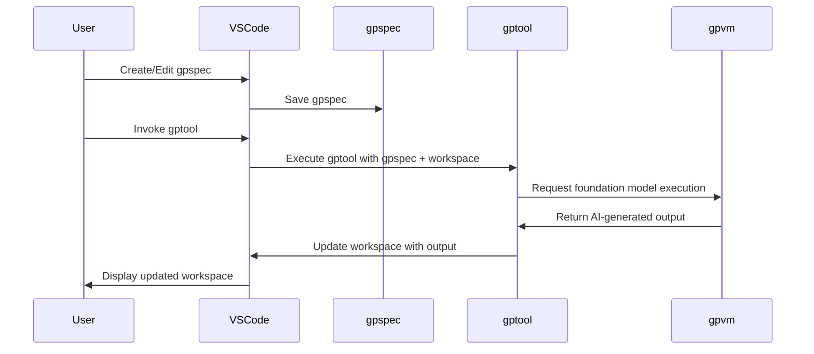

# GPTools - AI-Enhanced Workflows for Teams

GPTools (formerly CoArch) allows teams, including non-developers, to create and use AI-enhanced scripts (gptools). The framework leverages LLMs to enable a new kind of scripting that combines traditional code and natural language.

> Don't forget to turn on the sound.

https://github.com/microsoft/gptools/assets/4175913/74517b81-4b9c-47d9-8a5c-a15362b0d4db

## Key Objectives and Technical Elements

The main objectives of gptools are to improve automation, collaboration, and accessibility in the creation, understanding, and maintenance of complex GPT artifacts. The key elements of the gptools framework are:

-   [gptools](./docs/gptools.md): Scripts that integrate traditional code and natural language, leveraging foundation models in their execution.
-   [gpspecs](./docs/gpspecs.md): Natural language documents that instantiate gptools in a particular context.
-   [VS Code extension](./packages/vscode/README.md): Supporting seamless user interaction with gptools.
-   **gpvm**: A framework and runtime system that executes gpspecs and gptools.

GPTools uses hosted AI foundation models (OpenAI, Azure OpenAI, Llama, ...) using a [user-provided token](./docs/token.md).

### GPTool scripts

GPTool scripts use stylized JavaScript with minimal syntax. They are stored as files (`gptools/*.gptool.js`) in your project.

```js
gptool({
    title: "Technical proofreading",
    description: "Reviews the text as a tech writer.",
})

def("TEXT", env.file)

$`You are reviewing and updating TEXT 
to fix grammatical errors, 
fix spelling errors and make it technical.`
```

GPTools comes with builtin tools and allows you to fork and customize the AI prompts to your project specific needs.
This leverages VSCode language support (completion, coloring, error checking)
while remaining friendly to people not very familiar with JavaScript.
GPTools also provides detailed expansion logs to help you debug your templates.

Since gptool scripts are stored as files in the project, they can be shared, versioned, collaborated on by the entire development team
using the existing team development cycle.

In the future, we foresee that developers will create libraries of gptools and share them as libraries on their favorite package manager.

-   [Read more about gptools](./docs/gptools.md).

## GPSpec specifications

Natural language documents that instantiate gptools in a particular context. GPTools parses `*.gpspec.md` markdown files as specification.

```markdown
# email address recognizer

Write a function that takes a string
and returns true if the whole string is a valid email address,
false otherwise.
```

-   [Read more about gpspecs](./docs/gpspecs.md).

## User experience

This diagram demonstrates the AI-enhanced workflow process in gptools. The gpspec starts the `gptool`, which reads the `gpspec`, interacts with the gpvm and foundation model.
The AI-generated output is used to update the workspace, and the user interacts with the updated workspace through the gptools extension to VS code.



## Getting started

### Install in Visual Studio Code

These are the instructions to install the latest build of the extension manually in Visual Studio Code.

-   install [Visual Studio Code](https://code.visualstudio.com/Download)
-   open the [latest release](https://github.com/microsoft/gptools/releases/latest/),
-   download the `gptools.vsix` file
-   open Visual Studio Code
-   open the command palette and type **Extensions: Install from VSIX...**
-   load the `gptools.vsix` file

Until this extension is in the Marketplace, you will have to repeat these steps each time you want to upgrade the extension.

### Try a builtin tool

GPTools comes with sample tools and you don't need a gpspec to run those tools on any file. The easiest way to start playing with GPTools is to:

-   open a folder in Visual Studio Code
-   open any file, open the context menu and run "Run GPTool..."
-   select one of the builtin tools in the dropdown

### Create a gpspec

The default gpspec generated by GPTools is rather simplistic. You can improve the performance of the LLM
by creating a new gpspec with more instructions.

### Fork a tool

-   open the command palette
-   type "Fork a GPTool..." and select the tool you want to fork
-   pick a new name and start editing the tool

The tool will be available in the dropdown of the "Run GPTool..." command.

## Contributing

We accept contributions! Checkout the [CONTRIBUTING](./CONTRIBUTING.md) page for details and developer setup.

## Trademarks

This project may contain trademarks or logos for projects, products, or services. Authorized use of Microsoft
trademarks or logos is subject to and must follow
[Microsoft's Trademark & Brand Guidelines](https://www.microsoft.com/en-us/legal/intellectualproperty/trademarks/usage/general).
Use of Microsoft trademarks or logos in modified versions of this project must not cause confusion or imply Microsoft sponsorship.
Any use of third-party trademarks or logos are subject to those third-party's policies.
