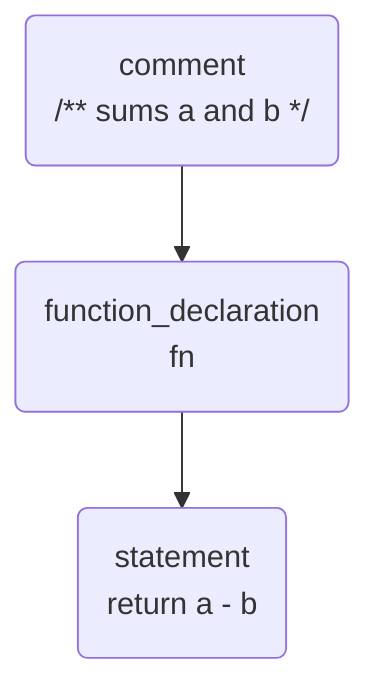
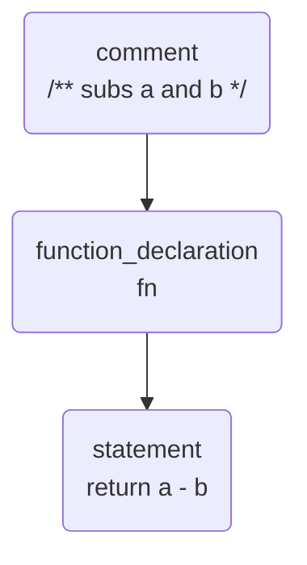

import { Code } from "@astrojs/starlight/components"
import code from "../../../../../genaisrc/docs.genai.mjs?raw"
import BlogNarration from "../../../components/BlogNarration.astro"

<BlogNarration />

This page describes a strategy to build GenAI scripts that use Abstract Syntax Trees (AST) to parse
and modify source code. When applicable, it provides an extremely flexible and stable way to
apply large scale changes to source code. Interested? Let's dive in!

:::tip

If you're in hurry, jump to the **last documentation generator/updater you'll ever need** \*
in the [sample section](#sample).

_\*: for TypeScript, maybe._
:::

## The strategy of AST-based code transformation

One of the challenge when creating GenAI scripts that update source code is to correctly locate and update source code.
The slightest mistake in the location of the code to update can lead to a broken code. This is especially true when
the code to update is not a simple string, but a complex structure like an object or a function call.

In some cases, you know "precisely" which part of the code you want
to update. For example, you want to refresh the documentation of a function after a change. You know
that the documentation is located just before the function definition at least in the sense of the programming language
but the number of empty lines or space may vary.

```ts title="math.ts"
/** sums a and b */
function fn(a: number, b: number): number {
    return a - b // oops outdated
}
```

In such scenario, you can use the Abstract Syntax Tree (AST) to locate the code to update. The AST is a tree representation of
code.



So instead of fighting spaces and new lines, you can just locate the `function_declaration` node that follows
a `comment` node.

```ts title="docs.genai.mts" wrap
const node = sg.search("functions without comments")
```

Once you've located the node to update, you could do any transformation you want, e.g. replace it with another text.
In terms of GenAI script, this means that you can build a prompt that includes as much context as you need, generate a response.

```ts title="docs.genai.mts" wrap
$`Update the documentation of the function 'fn' to reflect the new behavior of the function.`
fence(node.text())
```

```txt
/* subs a and b */
```

Once the LLM responds with the new comment, you could insert it as the new content of the node in the AST.

```ts title="docs.genai.mts"
edits.replace(node.comment(), response)
```



Voila! You've only touched the part of the file you wanted to update!

```ts title="math.ts"
/** subs a and b */
function fn(a: number, b: number): number {
    return a - b
}
```

To recap, this strategy is based on the following steps:

1. **search** Use the AST to locate the node to update.
2. **transform and replace** Use the LLM to generate the new content of the node.
3. **commit** Update the node in the AST with the new content.

## ast-grep


[ast-grep(sg)](https://ast-grep.github.io/) is a fast and polyglot tool for code structural search,
lint, rewriting at large scale. **sg** provides us the AST-search-and-replace capabilities we need to
implement the strategy above.

GenAIScript benefits from the excellent [Node.JS integration](https://ast-grep.github.io/reference/api.html#napi),
which is available through the [`host.astGrep()`](https://microsoft.github.io/genaiscript/reference/scripts/ast-grep) method.

### Searching

The `sg.search` method allows you to search for nodes in the AST. It takes the language, file glob
and pattern syntax and returns a list of matches.

```ts title="docs.genai.mts" wrap
// search
const { matches, replace } = await sg.search("ts", "src/*fib*.ts", {
    rule: {
        kind: "function_declaration",
        not: {
            precedes: {
                kind: "comment",
                stopBy: "neighbor",
            },
        },
    },
})
```

### Editing

The `sg.changeset` method creates a changeset that can be used to apply a set of edits to a set of files.

```ts
// transform
const edits = sg.changeset()
for (const match of matches) {
    const { text } = await prompt`Generate new docs for ${match.text()}`
    // replace
    edits.replace(match.comment(), text) // it's somewhat more involved
}
// commit all edits to file
await workspace.writeFiles(edits.commit())
```

## Sample: Doc generator / updater <a id="sample"></a>

You will find a full write down of the making of the documentation generator/updater script below
in the [documentation](/genaiscript/reference/scripts/ast-grep). I encourage you to read it to dig deeper.

The `docs` scripts is a documentation generator/updater.

- uses ast-grep to find and generate missing documentation for exported TypeScript function. A second LLM-as-Judge
  request is used to check that the generated documentation is correct.
- if the `diff` option is selected, it will filter out functions that do not intersect with the
  diff (this is rather naive but a good start...).
- it can also be used to update the documentation of a function that has changed.
- it works regardless of the file size or the number of files as most transformations are hyper-localized.

```sh title="generate and refresh my docs plz"
genaiscript run docs -- --diff
```

Here are some example of applications of the scripts (one-shot, no human edit, multi-edit per file):

- [TypeScript codebase](https://github.com/pelikhan/TypeScript/pull/1), I stopped the script after a while, it was humming.
- [GenAIScript codebase](https://github.com/microsoft/genaiscript/pull/1376/files), this change also contains the update to GenAIScript as I was building the feature.

Here it goes:

<Code code={code} lang="ts" wrap title="docs.genai.mts" />

- [original source](https://github.com/microsoft/genaiscript/blob/main/genaisrc/docs.genai.mts)