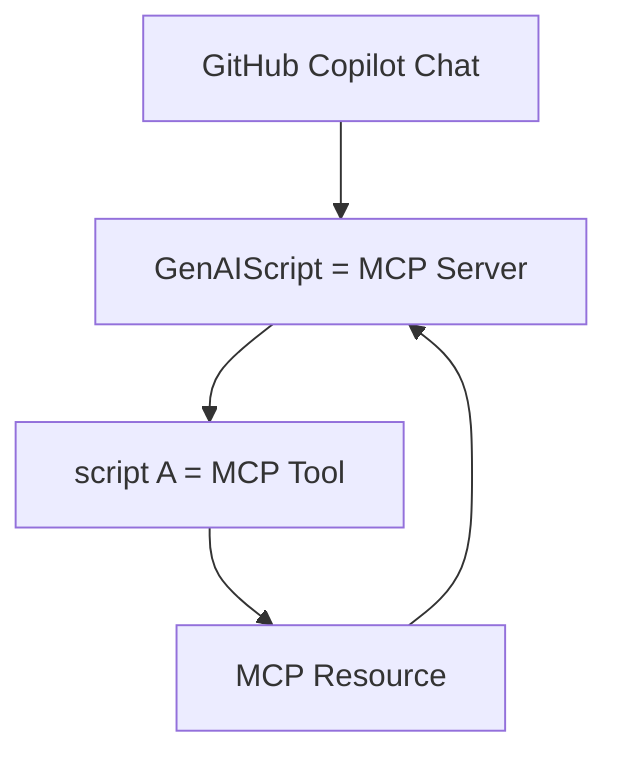

import BlogNarration from "../../../components/BlogNarration.astro"

<BlogNarration />

# MCP Resources

In a [previous post](/genaiscript/blog/scripts-as-mcp-tools/),
we announced how every script can be a [MCP tool](https://modelcontextprotocol.io/docs/concepts/tools).

To follow up on this idea, we added support for publishing [MCP resources](https://modelcontextprotocol.io/docs/concepts/resources)
as part of the script execution.

Resources are a core primitive in the Model Context Protocol (MCP)
that allow servers to expose data and content that can be read by clients and used as context for LLM interactions.



MCP handles discovery and resolution of resources, so once your script publishes a resource,
the MCP client (IDE) is made "aware" of it and it can decide to read it.

## `publishResource`

The `publishResource` method allows you to publish a resource with a unique identifier and a file/string/buffer.
The rest of the MCP resource publishing process is handled by the GenAIScript framework.

```js
const uri = await host.publishResource("unique-id", file)
```

## Next steps

Are you ready to build your own MCP tools and resources?

- [Read the documentation](/genaiscript/reference/scripts/mcp-server#resources)