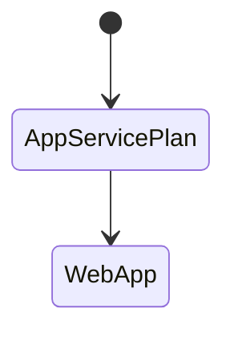

## Summary of Resources

The BICEP file creates the following Azure resources:
1. App Service Plan
2. Web App

## Resource Relationship Diagram



```js title="foo.genai.js"
$`Write a one sentence poem.`
```

```md title="output"
Beneath the silver moon's soft glow, the silent lake whispers secrets to the night.
```


```js
$`Write another poem`
```
