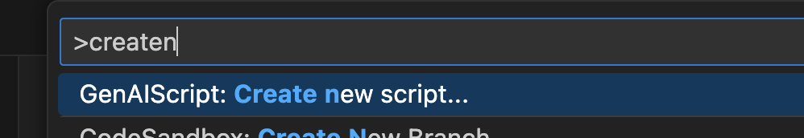

import { Tabs, TabItem } from "@astrojs/starlight/components"

<Tabs>
<TabItem label="Visual Studio Code, Cursor">

Use the `> GenAiScript: Create new script...` command in the [command palette](https://code.visualstudio.com/docs/getstarted/userinterface#_command-palette)
(`Ctrl+Shift+P` on Windows/Linux, `⇧⌘P` on Mac)
to create a new script.



</TabItem>
<TabItem label="Other Editors">

Run the [cli](/genaiscript/reference/cli/) `script create` command with the name of the script you want to create.

```bash
npx genaiscript script create proofreader
```

</TabItem>
</Tabs>
