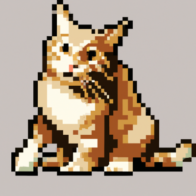
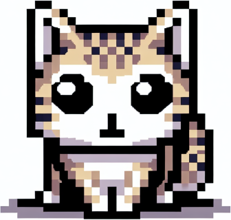
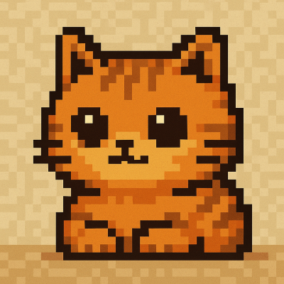

import BlogNarration from "../../../components/BlogNarration.astro"

<BlogNarration />

We've added support for the new OpenAI `gpt-image-1` image generation model.
You can try out through OpenAI's API or Azure AI Foundry.

```js 'model: "openai:gpt-image-1"'
... = await generateImage("...", {
    model: "openai:gpt-image-1",
})
```

To compare the performance of this model, here is a little script that
generate an pixelated cat image on DallE-2/3 and `gpt-image-1`.

```js title="images.genai.mjs" wrap
const { output } = env
for (const model of [
    "openai:dall-e-2",
    "openai:dall-e-3",
    "openai:gpt-image-1",
]) {
    output.heading(3, `Model: ${model}`)
    const { image, revisedPrompt } = await generateImage(
        `a cute cat. only one. iconic, high details. 8-bit resolution.`,
        {
            maxWidth: 400,
            mime: "image/png",
            model,
            size: "square",
        }
    )
    await env.output.image(image.filename)
    output.fence(revisedPrompt)
}
```

### Model: openai:dall-e-2



### Model: openai:dall-e-3



```
Visualize an adorable single feline, lavishly detailed, represented in charming 8-bit resolution. This cat is incredibly distinctive and recognizable, with unique features that make it stand out from the norm. Consider adding intricate patterns on its fur or any other unusual characteristics to boost the iconic nature of this cute cat.
```

### Model: openai:gpt-image-1


