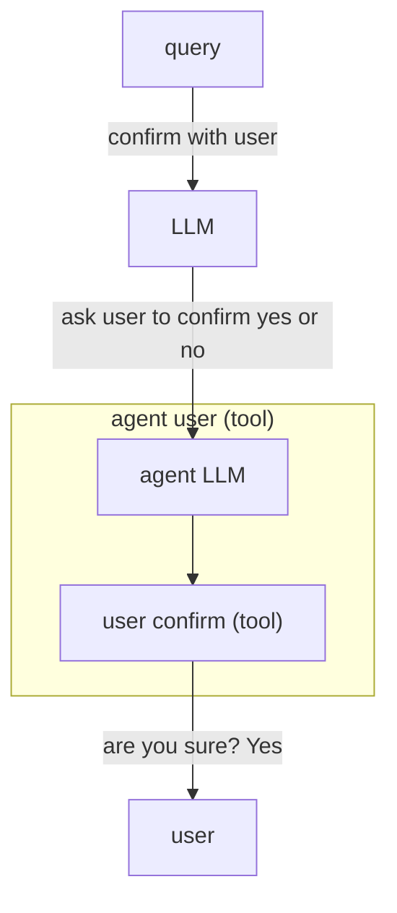

GenAIScript defines an **agent** as a [tool](/genaiscript/reference/scripts/tools) that
runs an [inline prompt](/genaiscript/reference/scripts/inline-prompts) to accomplish a task. The agent LLM is typically augmented with
additional tools.



In this blog post, we'll walk through building a `user interaction agent` that enables the agent to ask questions to the user.

```js wrap
script({
    tools: ["agent_user_input"],
})

$`
Imagine a funny question and ask the user to answer it.
From the answer, generate 3 possible answers and ask the user to select the correct one.
Ask the user if the answer is correct.
`
```

Let's dive into understanding how to create an "Agent that can ask questions to the user."

You can find the full script on GitHub right [here](https://github.com/microsoft/genaiscript/blob/main/packages/core/src/genaisrc/system.agent_user_input.genai.mjs).

## Metadata

The script is written in JavaScript. It starts by declaring the metadata to make the script available as a system script,
which can be reused in other scripts.

```js title="system.agent_user_input.genai.mjs"
system({
    title: "Agent that can ask questions to the user.",
})
```

This line sets up the title for our system, making it clear that it's intended to interact with the user by asking questions.

## title and description

The `defAgent` function defines the behavior of our agent. It takes an agent identifier and a description. These two are quite important,
as they will help the "host" LLM choose to use this agent.

```js wrap
defAgent(
    "user_input",
    "Ask user for input to confirm, select or answer a question.",
    ...
```

GenAIScript will automatically append a description of all the tools used by the agent prompt so you don't have to worry about that part in the description.

## prompt

The third argument is a string or a function to craft prompt instructions for the agent LLM call. The agent implementation already contains generic prompting
to make the prompt behave like an agent, but you can add more to specify a role, tone, and dos and don'ts.

```js wrap
defAgent(
    ...,
    `You are an agent that can ask questions to the user and receive answers. Use the tools to interact with the user.
    - the message should be very clear. Add context from the conversation as needed.`,
    ...
```

## model configuration

The last argument is a set of model options, similar to [runPrompt](/genaiscript/reference/scripts/inline-prompts), to configure the LLM call made by the agent.
In particular, this is where you list the tools that the agent can use.

```js 'tools: ["user_input"]' wrap
defAgent(
    ..., {
        tools: ["user_input"],
    }
)
```

## How to use the agent

The agent is used like any other [tool](/genaiscript/reference/scripts/tools) by referencing it in the `script` options.

```js 'tools: ["agent_user_input"]'
script({
    tools: ["agent_user_input"]
})
...
```

## Let's try it!

Let's try the agent with:

```js wrap
script({
    tools: ["agent_user_input"],
})

$`Imagine a funny question and ask the user to answer it.
From the answer, generate 3 possible answers and ask the user to select the correct one.
Ask the user if the answer is correct.`
```

and let's look at the results...

```txt wrap
prompting openai:gpt-4o (~150 tokens)

agent user_input: What would be the most unexpected thing to find inside a refrigerator?
run prompt agent user_input
prompting openai:gpt-4o (~234 tokens)

user input text: What would be the most unexpected thing to find inside a refrigerator?
```

✔ What would be the most unexpected thing to find inside a refrigerator? toaster

```txt wrap
prompting openai:gpt-4o (~240 tokens)
toaster
prompting openai:gpt-4o (~156 tokens)

agent user_input: Based on your answer, which of the following would also be unexpected to find inside a refrigerator?
1. A television
2. A penguin
3. A snowman

Please select the correct answer.
run prompt agent user_input
prompting openai:gpt-4o (~263 tokens)

user input select: Based on your answer, which of the following would also be unexpected to find inside a refrigerator?
```

✔ Based on your answer, which of the following would also be unexpected to find inside a refrigerator? A television

```txt wrap
prompting openai:gpt-4o (~269 tokens)
A television
prompting openai:gpt-4o (~162 tokens)

agent user_input: Is your selection of 'A television' the correct unexpected item to find inside a refrigerator?
run prompt agent user_input
prompting openai:gpt-4o (~239 tokens)

user input confirm: Is your selection of 'A television' the correct unexpected item to find inside a refrigerator?
```

✔ Is your selection of 'A television' the correct unexpected item to find inside a refrigerator? yes

```txt wrap
prompting openai:gpt-4o (~244 tokens)
true
prompting openai:gpt-4o (~167 tokens)
Great choice! A television inside a refrigerator would indeed be quite unexpected.
```
