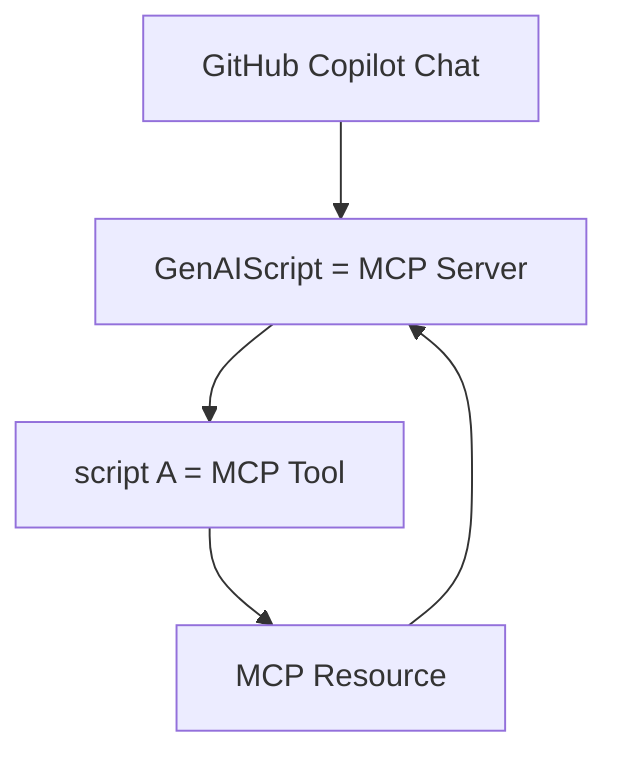

import BlogNarration from "../../../components/BlogNarration.astro";

<BlogNarration />

# MCP Resources

In a [previous post](/genaiscript/blog/scripts-as-mcp-tools/),
we announced how every script can be a [MCP tool](https://modelcontextprotocol.io/docs/concepts/tools).

To follow up on this idea, we added support for publishing [MCP resources](https://modelcontextprotocol.io/docs/concepts/resources)
as part of the script execution.

Resources are a core primitive in the Model Context Protocol (MCP)
that allow servers to expose data and content that can be read by clients and used as context for LLM interactions.



MCP handles discovery and resolution of resources, so once your script publishes a resource,
the MCP client (IDE) is made "aware" of it and it can decide to read it.

## ResourceHost Methods

The ResourceHost interface provides several methods for working with MCP resources:

### `publishResource`

The `publishResource` method allows you to publish a resource with a unique identifier and a file/string/buffer.
The rest of the MCP resource publishing process is handled by the GenAIScript framework.

```js
const uri = await host.publishResource("unique-id", file);
```

You can also provide additional options like description and MIME type:

```js
const uri = await host.publishResource("my-data", content, {
  description: "A sample data file",
  mimeType: "application/json"
});
```

### `resources`

The `resources` method returns a list of all available resource references that have been published.

```js
const resourceRefs = await host.resources();
for (const ref of resourceRefs) {
  console.log(`Resource: ${ref.name} (${ref.uri})`);
  if (ref.description) console.log(`  Description: ${ref.description}`);
  if (ref.mimeType) console.log(`  Type: ${ref.mimeType}`);
}
```

### `resolveResource`

The `resolveResource` method allows you to resolve URLs to retrieve associated files and resources.
It supports various protocols including https, file, git, gist, and vscode.

```js
const result = await host.resolveResource("https://raw.githubusercontent.com/user/repo/main/README.md");
if (result) {
  console.log(`Resolved URL: ${result.uri}`);
  for (const file of result.files) {
    console.log(`File: ${file.filename}`);
    // Access file.content for the actual content
  }
}
```

Supported URL patterns include:

- **HTTPS URLs**: Direct file downloads from web servers
- **GitHub blob URLs**: Automatically converted to raw content URLs
- **GitHub asset URLs**: Resolved through GitHub API  
- **Gist URLs**: Access to GitHub gists (e.g., `https://gist.github.com/user/gistid`)
- **Git repositories**: Clone and access files (e.g., `https://github.com/user/repo.git`)
- **VSCode URLs**: gistfs extension URLs for accessing gists

```js
// Examples of supported URL patterns
await host.resolveResource("https://github.com/user/repo/blob/main/file.txt");
await host.resolveResource("gist://abc123def456/myfile.js");  
await host.resolveResource("https://github.com/user/repo.git/path/to/file");
await host.resolveResource("vscode://vsls-contrib.gistfs/open?gist=123&file=script.js");
```

## Next steps

Are you ready to build your own MCP tools and resources?

- [Read the documentation](/genaiscript/reference/scripts/mcp-server#resources)
