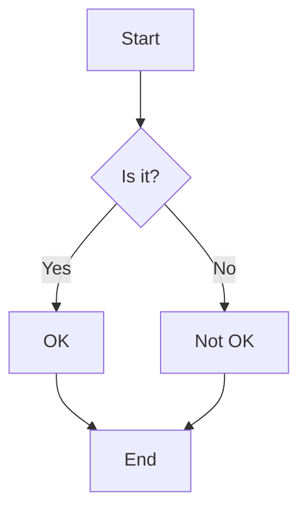
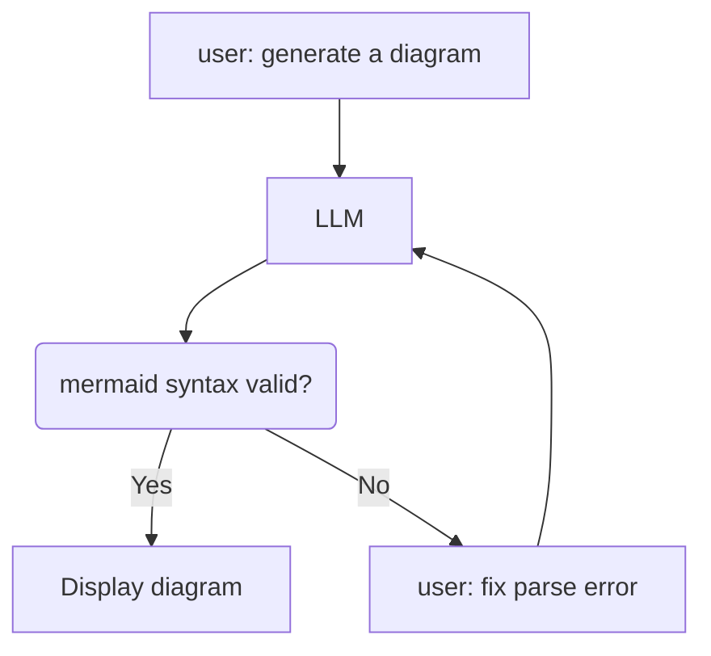
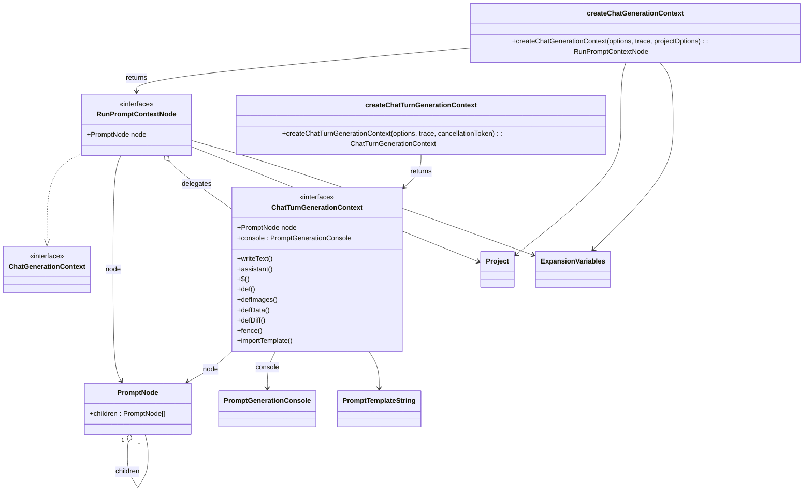

[Mermaid diagrams](https://mermaid.js.org/) are a popular way to create [diagrams](/genaiscript/reference/scripts/diagrams) in markdown.
They are used in many projects, [including in GitHub Markdown](https://docs.github.com/en/get-started/writing-on-github/working-with-advanced-formatting/creating-diagrams).
Since there are so many examples of mermaid diagrams in the wild,

it is not surprising that LLMs are pretty good at generating them.

## Mermaid diagrams in Markdown

Mermaid supports a number of diagram types and quite a few options to control the appearance of nodes and edges.
You can try out different diagrams in the [Mermaid playground](https://www.mermaidchart.com/play)

Here is a simple example of a flowchart:

````markdown

````

This markdown will be rendered as a flowchart in preview mode (and in GitHub!):


## Syntax errors

One issue with mermaid is that... syntax matters and LLM sometimes get it wrong.
Let's introduce a syntax error in the example above.

````markdown del="B ->|Yes|"
```mermaid
graph TD
    A[Start] --> B{Is it?}
    B ->|Yes| C[OK]
    B -->|No| D[Not OK]
    C --> E[End]
    D --> E
```
````

Now mermaid fails to parse and the diagram is not rendered:

```text wrap
Parse error on line 3:
...--> B{Is it?}    B ->|Yes| C[OK]    B
----------------------^
Expecting 'SEMI', 'NEWLINE', 'EOF', 'AMP', 'START_LINK', 'LINK', 'LINK_ID', got 'MINUS'
```

In most cases, the LLM is able to fix the syntax error and generate a valid diagram using the error message.

## Automatic repair

We have added a "repairer" in [system.diagrams](/genaiscript/reference/scripts/system#systemdiagrams) system prompt.
The repairer looks for `mermaid` code blocks in the output and tries to parse them.
If it the diagram has parse errors, the repairer adds a message to the chat to fix those.



Here is a trace of a simple script that generates a diagram from any code.

```js wrap title="mermaid.genai.mjs"
def("CODE", env.files)
$`Generate a class diagram using mermaid of the code symbols in the CODE.`
```

We run the [cli](/genaiscript/reference/cli) with the `mermaid.genai.mjs` script and the [runpromptcontext.ts file](https://github.com/microsoft/genaiscript/tree/main/packages/core/src/runpromptcontext.ts).

```sh wrap
genaiscript run mermaid packages/core/src/runpromptcontext.ts
```

### First attempt

The script generates a prompt with the code and the instructions to generate a diagram.

````text wrap
┌─💬 github:gpt-4.1 ✉ 2 ~↑9.2kt
┌─📙 system
│## Safety: Jailbreak
│... (18 lines)
│Use clear, concise node and relationship labels.
│Implement appropriate styling and colors to enhance readability.
┌─👤 user
│<CODE lang="ts" file="packages/core/src/runpromptcontext.ts">
│import debug from "debug"
│const dbg = debug("genaiscript:prompt:context")
│// cspell: disable
│import {
│    PromptNode,
│... (1202 lines)
│        env,
│    })
│    return ctx
│}
│</CODE>
│Generate a class diagram using mermaid of the code symbols in the CODE.

```mermaid
classDiagram
    %% Main context classes and interfaces
    class ChatTurnGenerationContext {
        <<interface>>
        +node: PromptNode
...
    %% Highlights to show this is a function producing a context with many callable methods.
    class createChatGenerationContext,createChatTurnGenerationContext highlightFunction;
    classDef highlightFunction fill:#f5f,stroke:#333,stroke-width:1.5px;
```
This diagram summarizes the main types, classes, and their relationships from `runpromptcontext.ts`. The context factories (`createChatGenerationContext`, `createChatTurnGenerationContext`) produce context "objects" rich in methods. Some utilities and dependencies are shown for structure clarity.

└─🏁  github:gpt-4.1 ✉ 2 7418ms ⇅ 9.7kt ↑8.8kt ↓892t 2.47¢
````

### Syntax error detected, repairer activated

The mermaid diagrem generated has a syntax error.

```text wrap
Parse error on line 107:
...hatGenerationContext,createChatTurnGener
-----------------------^
Expecting 'NEWLINE', 'EOF', 'SQS', 'STR', 'DOT', 'GENERICTYPE', 'LABEL', 'STRUCT_START', 'STRUCT_STOP', 'STYLE_SEPARATOR', 'ANNOTATION_END', 'ALPHA', 'AGGREGATION', 'EXTENSION', 'COMPOSITION', 'DEPE…
```

The repairer enters the game and responds to the assistant with a message to fix the error. The entire chat conversation is sent back to the LLM
, including the error message.

````text {11-20} wrap
┌─💬 github:gpt-4.1 ✉ 4 ~↑10.5kt
┌─📙 system
│...
┌─👤 user
│...
│Generate a class diagram using mermaid of the code symbols in the CODE.
┌─🤖 assistant
│```mermaid
│...
│```
┌─👤 user
│I found syntax errors in the mermaid diagram. Please repair the parse error:
│Parse error on line 107:
│...hatGenerationContext,createChatTurnGener
│-----------------------^
│Expecting 'NEWLINE', 'EOF', 'SQS', 'STR', 'DOT', 'GENERICTYPE', 'LABEL', 'STRUCT_START', 'STRUCT_STOP', 'STYLE_SEPARATOR', 'ANNOTATION_END', 'ALPHA', 'AGGREGATION', 'EXTENSION', 'COMPOSITION', 'DEPE…
````

### The LLM repairs the diagram

In this case, the LLM is able to repair the diagram and generate a valid mermaid diagram.

````text wrap
```mermaid
classDiagram
    %% Core Context Interfaces and Classes
    class ChatTurnGenerationContext {
        <<interface>>
...
    %% Factory highlighting (removed previous classDef/annotations for compatibility)
```
This diagram removes invalid classDef and annotation syntax and corrects relationship/arrows for Mermaid compatibility.

└─🏁  github:gpt-4.1 ✉ 4 3741ms ⇅ 10.3kt ↑9.9kt ↓457t 2.34¢
````

### The repaired diagram

Finally, the repaired diagram is returned to the user:



## Can I parse mermaid diagrams myselft?

Yes, you can use `parsers.mermaid` to parse mermaid diagrams in your scripts
programmatically.
