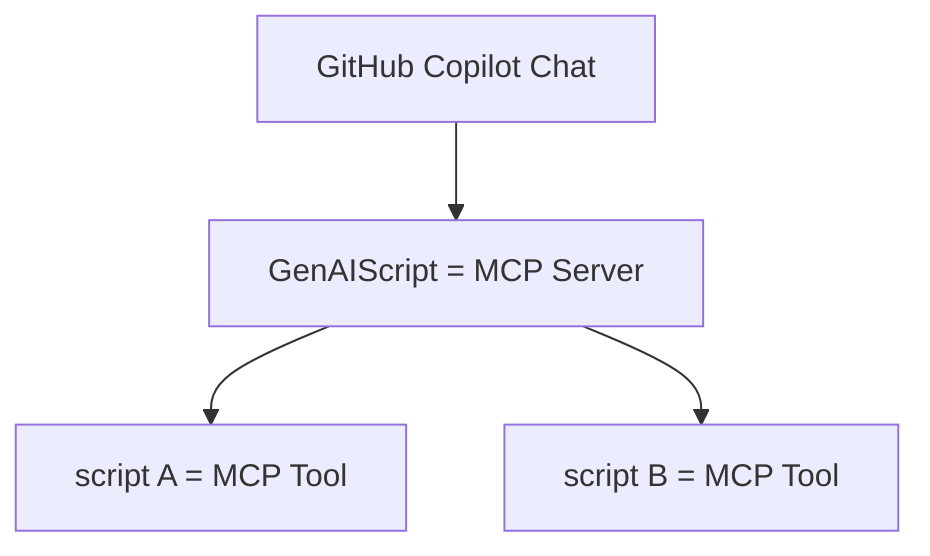

import BlogNarration from "../../../components/BlogNarration.astro"

<BlogNarration />

🚀 The [Model Context Protocol (MCP)](https://modelcontextprotocol.io/introduction) is taking the tech world by storm, and we're thrilled to announce that GenAIScript is at the forefront of this revolution!

With the rapid adoption of MCP, tools like GitHub Copilot Chat are already integrating support (available in Insiders today), and [Copilot Studio](https://www.microsoft.com/en-us/microsoft-copilot/blog/copilot-studio/introducing-model-context-protocol-mcp-in-copilot-studio-simplified-integration-with-ai-apps-and-agents/) has just announced their support as well.

To keep up with these exciting advancements, **[GenAIScript now allows you to expose scripts as MCP tools](/genaiscript/reference/scripts/mcp-server)**. Imagine the possibilities! MCP tools function similarly to LLM tools, where the Language Model (LLM) decides when to call them, making your development process smarter and more efficient.

Dive into the future of scripting with GenAIScript and MCP. Check out the [documentation](/genaiscript/reference/scripts/mcp-server) to get started.
