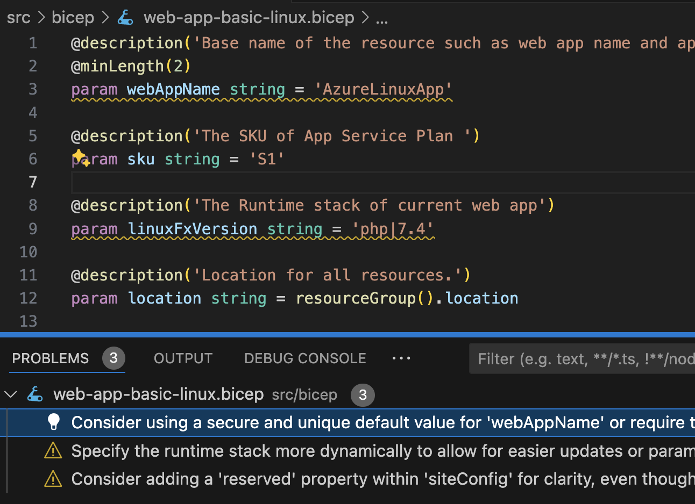

import { Code } from '@astrojs/starlight/components';
import bicepSource from "../../../../../packages/sample/src/bicep/web-app-basic-linux.bicep?raw"
import scriptSource from "../../../../../packages/sample/genaisrc/bicep-best-practices.genai.js?raw"

[Azure Bicep](https://learn.microsoft.com/en-us/azure/azure-resource-manager/bicep/overview?tabs=bicep) is a Domain Specific Language (DSL) for deploying Azure resources declaratively. 
It is a language that is designed to be a more readable 
and maintainable way to define Azure resources. 

Bicep comes with a [linter](https://learn.microsoft.com/en-us/azure/azure-resource-manager/bicep/linter) that detects various faults, but also comes with
online best practices which are not completely covered by the linter.

## Web App Basic Linux

The following is a Bicep file that deploys a web app with a Linux app service plan.
It is the **microsoft.web/webapp-basic-linux/main.bicep** 
sample template in the [bicep playground](https://azure.github.io/bicep/).

<Code code={bicepSource} wrap={true} lang="bicep" title="web-app-basic-linux.bicep" />

## Script

The file is `linter` clean, but some improvements could be made with best practices.
The following script will apply best practices to the Bicep file.

The script uses a builtin support for [annotations](/genaiscript/reference/scripts/annotations) 
to generate parseable warnings and errors. Annotations are automatically integrated as problems 
in VSCode or as build errors in the CI/CD pipeline.

<Code code={scriptSource} wrap={true} lang="js" title="bicep-best-practices.genai.js" />

Notice that we added support to ignore false positives using the `#disable-next-line genaiscript`
annotation as well.

## Results

The LLM generates 3 annotations for the Bicep file. The annotations are surfaced 
as squiggly lines in VSCode.

