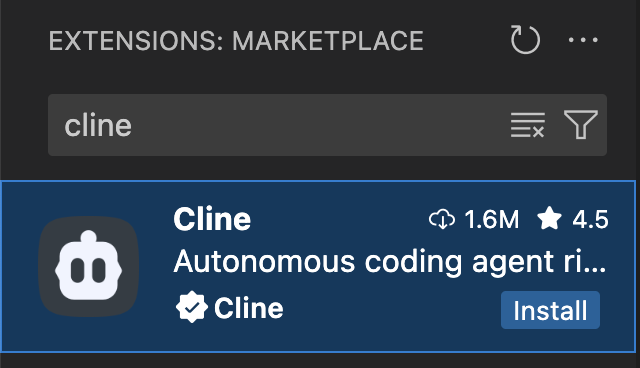
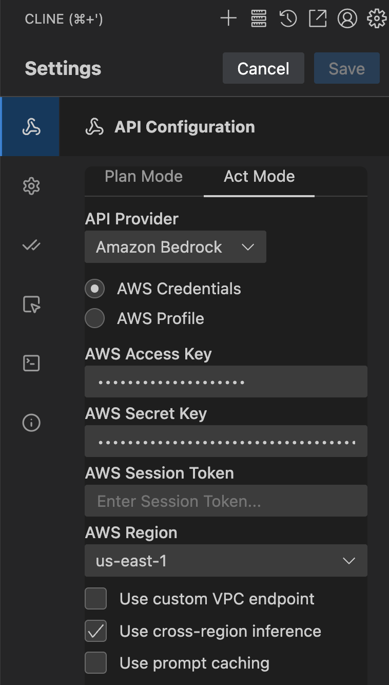
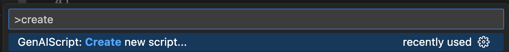

***

import BlogNarration from "../../../../components/BlogNarration.astro";

<BlogNarration />

## Introduction

GenAIScript facilite la prise en main pour coder des workflows LLM. Cependant, il peut être difficile de l'utiliser efficacement pour écrire des workflows complexes, car les techniques avancées et les optimisations de performance peuvent être hors de portée de nombreux développeurs. Dans cet article, nous allons explorer comment les assistants de codage peuvent nous aider à écrire des workflows GenAIScript avancés plus rapidement et avec moins d'effort.

## La tâche

Documenter du code existant est une tâche courante dans le développement logiciel. Cela peut être chronophage et est souvent négligé. Pourtant, cela est essentiel pour maintenir la qualité du code et s'assurer que le code est compréhensible par d'autres développeurs.

Notre objectif aujourd'hui est d'écrire un workflow GenAIScript qui ajoute automatiquement des commentaires JSDoc au code TypeScript qui n'en possède pas encore.

Le script utilisera les fonctions AST grep pour rechercher dans le code, puis utilisera un grand modèle de langage pour générer des commentaires JSDoc pour le code, et modifiera le code pour y ajouter les commentaires en place.

AST grep est une fonctionnalité avancée de GenAIScript qui nous permet de rechercher des motifs spécifiques dans l'arbre syntaxique abstrait (AST) du code. C'est beaucoup plus efficace que d'utiliser les LLM pour analyser le code, car cela nous permet de trouver rapidement des segments de code qui correspondent à des critères spécifiques.

Peli a exploré cette fonctionnalité dans son article [AST Grep and Transform](https://microsoft.github.io/genaiscript/blog/ast-grep-and-transform/), et nous allons nous appuyer sur cela pour créer notre script.

Voici un exemple de ce que nous souhaitons accomplir :

```ts wrap
// Before
function calculateTotal(price: number, tax: number): number {
    return price + price * tax
}

// After
/**
 * Calculates the total amount including tax
 * @param {number} price - The base price
 * @param {number} tax - The tax rate as a decimal
 * @returns {number} The total amount including tax
 */
function calculateTotal(price: number, tax: number): number {
    return price + price * tax
}
```

## Pourquoi GenAIScript et pas l'agent de codage ?

Il y a plusieurs raisons pour lesquelles GenAIScript est un meilleur choix que l'utilisation d'assistants de codage en mode agentique pour réaliser les mêmes tâches.

**Vitesse** : Les workflows GenAIScript peuvent être exécutés en parallèle, ce qui peut significativement réduire le temps nécessaire pour terminer les tâches. Imaginez attendre qu'un assistant de codage génère du code pour un gros projet dans votre éditeur, comparé au lancement d'un workflow GenAIScript qui peut exécuter plusieurs tâches en arrière-plan. Que préféreriez-vous ?

**Efficacité économique** : GenAIScript vous donne un contrôle bas niveau sur vos invites, ce qui vous permet d’optimiser celles-ci pour votre cas d’utilisation spécifique. Cela signifie que vous pouvez réduire le nombre de jetons utilisés, ce qui peut vous faire économiser de l’argent sur l’utilisation des LLM.

**Partageabilité** : Vous pouvez partager vos workflows GenAIScript avec d’autres développeurs de votre équipe. Vous pensez peut-être : « Mais je peux aussi partager mes invites d’assistant de codage ! » Cependant, les workflows GenAIScript sont plus que de simples invites ; ce sont des scripts autonomes qui enchaînent plusieurs appels LLM pour effectuer une tâche spécifique. Cela les rend plus puissants et flexibles qu’une simple invite.

## Installation

Nous utiliserons Cline pour écrire notre code GenAIScript. Mais vous pouvez utiliser n’importe quel assistant de codage, y compris Github Copilot, Cursor ou Windsurf.

Tout d’abord, installons Cline depuis le Marketplace de VS Code.



Ensuite, nous configurerons Cline avec nos identifiants. Si vous utilisez Bedrock, comme moi, vous devrez définir les variables d’environnement `AWS_ACCESS_KEY_ID` et `AWS_SECRET_ACCESS_KEY` dans votre terminal.



Maintenant, nous sommes prêts à écrire notre code GenAIScript. Nous ouvrirons notre projet et le préparerons pour le développement GenAIScript. Cela implique de créer un nouveau fichier script. Je crée toujours un fichier appelé poem.



Enfin, nous écrirons une invite pour que Cline génère le code GenAIScript. L’invite décrira la tâche que nous voulons accomplir, et Cline générera le code pour nous.

## L’invite

Voici l’invite que j’ai écrite pour Cline afin de générer le code GenAIScript. Elle est conçue pour être claire et concise, tout en fournissant suffisamment de détails pour que Cline comprenne la tâche.

```md wrap
You are an expert software engineer, familiar in all aspects of TypeScript and GenAIScript. You will find the documentation for GenAIScript at https://microsoft.github.io/genaiscript/llms.txt. Make sure to follow the links in all the Documentation Sets to understand the full capabilities of GenAIScript before writing the script.

## Task

Your task is to write a GenAIScript script called that searches for the code in a path specified by the user using the AST grep functions, looking for functions, classes, and methods that do not have JSDoc comments. Use AST grep search functionality to perform the search.

For each function, class, or method found, the script invokes a large language model call to generate JSDoc comments that explain the code, with examples of how to use it.

The script then takes the output of this call and modifies the code to add the JSDoc comments in place, prepending the comments above the source code.

## Guidelines

The source code is written in TypeScript ESM for node.js v20+.

## Output Format

- Output a single GenAIScript script file. The file name should be `jsdoc-commentator.genai.mts`.
```

## Analyse de l’invite

L’invite utilise plusieurs techniques pour s’assurer que le script généré répond à nos exigences :

1. **Expertise** : L’invite spécifie que l’assistant doit être un expert en TypeScript et GenAIScript, ce qui garantit que le code généré sera de haute qualité.
2. **Documentation** : L’invite fournit un lien vers la documentation GenAIScript, permettant à l’assistant de comprendre toutes les capacités de GenAIScript et de les utiliser efficacement.
3. **Définition de la tâche** : L’invite définit clairement la tâche, y compris les exigences spécifiques pour rechercher du code sans commentaires JSDoc et générer des commentaires à l’aide d’un grand modèle de langage.
4. **Directives** : L’invite précise que le code source est écrit en TypeScript ESM pour node.js v20+, ce qui garantit que le code généré sera compatible avec notre projet.
5. **Format de sortie** : L’invite spécifie le format de sortie, y compris le nom du fichier et la structure attendue du script.

## Résultats

Après avoir écrit l’invite, nous utilisons Cline pour générer le code GenAIScript. Cline analysera l’invite et générera un script qui répond à nos exigences.

Voici le script que Cline a généré pour moi (votre script peut légèrement varier) :

```ts wrap
script({
  title: "Add JSDoc Comments to TypeScript Code",
  description:
    "Automatically generates JSDoc comments for TypeScript functions, classes, methods, and interfaces that are missing documentation",
  model: "large",
  parameters: {
    glob: {
      type: "string",
      description: "Glob pattern for TypeScript files to process",
      default: "**/*.{ts,tsx}",
    },
    updateExisting: {
      type: "boolean",
      description: "Update existing JSDoc comments",
      default: false,
    },
    applyEdits: {
      type: "boolean",
      description: "Apply the edits automatically",
      default: false,
    },
  },
});

// Find TypeScript files to process
const files = await workspace.findFiles(env.vars.glob || "**/*.{ts,tsx}", {
  ignore: ["**/node_modules/**", "**/dist/**", "**/*.d.ts"],
});

if (files.length === 0) {
  env.output.log(
    `No TypeScript files found matching pattern: ${
      env.vars.glob || "**/*.{ts,tsx}"
    }`
  );
  cancel("No files to process");
}

env.output.log(
  `Found ${files.length} TypeScript files to analyze for missing JSDoc comments.`
);

// Define ast-grep patterns to find declarations without JSDoc
const astPatterns = [
  // Function declarations
  {
    name: "function_declaration",
    pattern: {
      rule: {
        kind: "export_statement",
        has: {
          kind: "function_declaration",
          has: {
            kind: "identifier",
            field: "name",
          },
        },
        not: {
          follows: {
            kind: "comment",
            stopBy: "neighbor",
          },
        },
      } satisfies SgRule,
    },
    description: "function declaration",
  },
  // Interface declarations
  {
    name: "interface_declaration",
    pattern: {
      rule: {
        kind: "export_statement",
        has: {
          kind: "interface_declaration",
          has: {
            kind: "type_identifier",
            field: "name",
          },
        },
        not: {
          follows: {
            kind: "comment",
            stopBy: "neighbor",
          },
        },
      } satisfies SgRule,
    },
    description: "interface declaration",
  },
  // Method definitions in classes
  {
    name: "method_definition",
    pattern: {
      rule: {
        kind: "method_definition",
        not: {
          follows: {
            kind: "comment",
            stopBy: "neighbor",
          },
        },
      } satisfies SgRule,
    },
    description: "method declaration",
  },
  // Arrow functions assigned to variables
  {
    name: "arrow_function",
    pattern: {
      rule: {
        kind: "export_statement",
        has: {
          kind: "lexical_declaration",
          has: {
            kind: "variable_declarator",
            has: {
              kind: "arrow_function",
              field: "value",
            },
          },
        },
        not: {
          follows: {
            kind: "comment",
            stopBy: "neighbor",
          },
        },
      } satisfies SgRule,
    },
    description: "arrow function",
  },
  // Type aliases
  {
    name: "type_alias",
    pattern: {
      rule: {
        kind: "export_statement",
        has: {
          kind: "type_alias_declaration",
          has: {
            kind: "type_identifier",
            field: "name",
          },
        },
        not: {
          follows: {
            kind: "comment",
            stopBy: "neighbor",
          },
        },
      } satisfies SgRule,
    },
    description: "type alias declaration",
  },
];

type Target = {
  match: SgNode; // The original match object for reference
};
const allTargets: Target[] = [];

// Get ast-grep instance
const sg = await host.astGrep();

// Process each file using ast-grep
for (const file of files) {
  // Check each ast-grep pattern
  for (const astPattern of astPatterns) {
    try {
      const targets: Target[] = [];
      // Use ast-grep to find matches
      const { matches } = await sg.search(
        "ts",
        file.filename,
        astPattern.pattern
      );
      const edits = sg.changeset();

      for (const match of matches) {
        targets.push({
          match: match,
        });
      }

      await processTargets(edits, targets);
    } catch (error) {
      console.error(`Error processing pattern ${astPattern.name}:`, error);
      // Continue with next pattern
    }
  }
}

if (allTargets.length === 0) {
  env.output.log(
    "✅ All TypeScript declarations already have JSDoc comments or no declarations found."
  );
  cancel("No work needed");
}

env.output.log(
  `Found ${allTargets.length} TypeScript declarations missing JSDoc comments.`
);

if (!env.vars.applyEdits) {
  env.output.heading(2, "Preview Mode");
  env.output.log(
    "Set `applyEdits: true` to automatically apply the generated JSDoc comments to your source files."
  );
}

async function processTargets(edits: SgChangeSet, targets: Target[]) {
  allTargets.push(...targets);
  // Generate JSDoc for each target using inline prompts
  for (const target of targets) {
    const codeText = target.match.text();

    // Generate JSDoc comment for this specific declaration
    const jsdocComment = await runPrompt(
      (ctx) => {
        ctx.def("CODE", codeText);
        ctx.$`Generate a JSDoc comment for <CODE>. 

Requirements:
- Use proper JSDoc syntax with /** */
- Include appropriate tags (@param, @returns, @throws, etc.)
- Write clear, concise descriptions
- Return ONLY the JSDoc comment block, no other text or code`;
      },
      { model: "large", temperature: 0.1 }
    );

    // Extract the JSDoc comment from the response
    const jsdoc =
      parsers.unfence(jsdocComment.text, "typescript") || jsdocComment.text;

    // Prepend the JSDoc comment to the code
    const newCode = jsdoc + "\n" + codeText;

    if (env.vars.applyEdits) {
      // Apply the edit to add JSDoc comment using changeset
      edits.replace(target.match, newCode);
    } else {
      // Preview mode - show what would be generated
      env.output.heading(4, "JSDoc Comment with Code");
      env.output.fence(newCode, "typescript");
    }
  }

  const modifiedFiles = edits.commit();
  await workspace.writeFiles(modifiedFiles);
}

if (env.vars.applyEdits) {
  env.output.log(
    `✅ Successfully added JSDoc comments to ${allTargets.length} TypeScript declarations.`
  );
} else {
  env.output.log(
    `📋 Preview complete. Found ${allTargets.length} declarations that need JSDoc comments.`
  );
  env.output.log(
    "To apply these changes, run the script with `applyEdits: true`."
  );
}

```

## Exécution du script

Pour exécuter le script, il faut le lancer dans notre terminal. Assurez-vous que GenAIScript est bien installé et configuré.

```sh wrap
npx genaiscript run jsdoc-commentator.genai.mts
```

## Conclusion

Dans cet article, nous avons exploré comment les assistants de codage peuvent nous aider à écrire des workflows GenAIScript plus rapidement et avec moins d’effort. Nous avons utilisé Cline pour générer un script qui ajoute automatiquement des commentaires JSDoc au code TypeScript qui n’en avait pas encore. Nous avons également discuté des avantages d’utiliser GenAIScript plutôt que des assistants de codage en mode agent pour cette tâche.

<hr />

Traduit par IA. Veuillez vérifier le contenu pour plus de précision.
