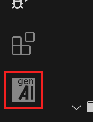

import { FileTree } from '@astrojs/starlight/components';
import { Steps } from '@astrojs/starlight/components';

GenAiScript is available as a Visual Studio Code Extension. You can download it from the Marketplace
or access the latest development build from GitHub.

The [Visual Studio Code Marketplace](https://marketplace.visualstudio.com/) 
contains the latest stable release of the [extension](https://marketplace.visualstudio.com/items?itemName=genaiscript.genaiscript-vscode).

<Steps>

<ol>
<li>

Install [Visual Studio Code](https://code.visualstudio.com/Download). 

Visual Studio Code is a lightweight but powerful source code editor which runs on your desktop and is available for Windows, macOS and Linux. 

</li>
<li>
Open your project folder in Visual Studio Code.

</li>
<li>
Click on the **Extensions** view

</li>
<li>

Search **genaiscript** and click **Install**.

</li>

<li>

If successful, you will see the icon in the **Extensions** view.

</li>

</ol>

</Steps>

## Next steps

Let's configure the [LLM connection information](/genaiscript/getting-started/configuration)

## Advanced: GitHub Releases

The latest development build of the extension is also available on through the GitHub releases. This allows access
to bug fixes earlier than the marketplace release.

-   download the [latest release](https://github.com/microsoft/genaiscript/releases/latest/) on GitHub (if you are getting a 404 page, you need to sign in),
-   download the `genaiscript.vsix` into your project in VSCode
-   right click on the `.vsix` file and select **Install Extension VSIX...**

<FileTree>

-  ...
-  .genaiscript/ folder created by the extension to store supporting files
    -  genaiscript.cjs command line
    -  cache/ various cache files
    -  retreival/ retreival database caches
    -  ... supporting files
-   **genaiscript.vsix**

</FileTree>
