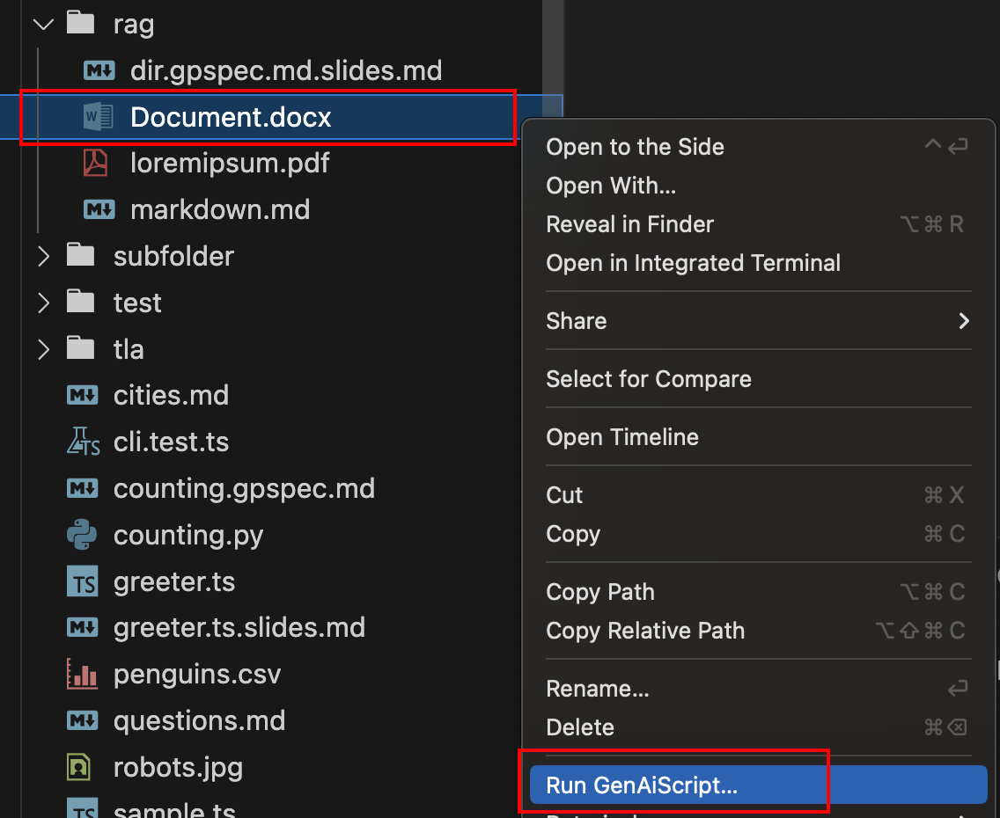
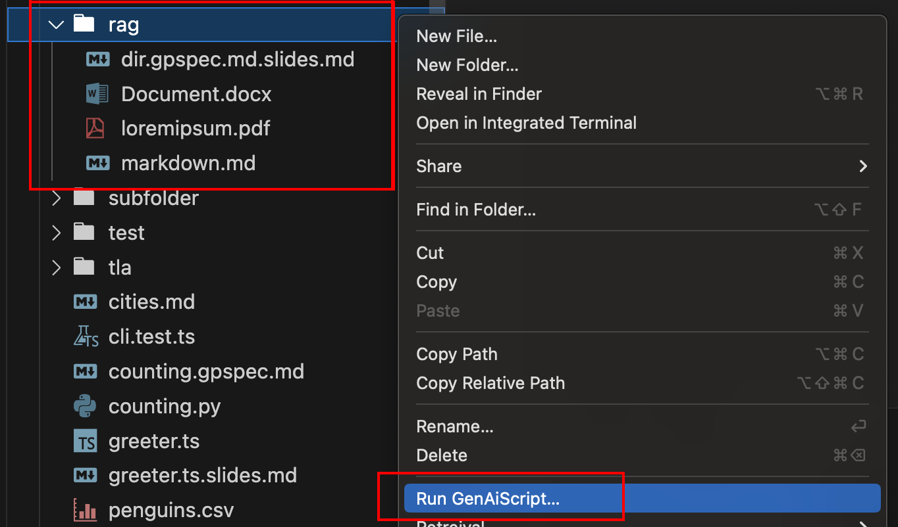
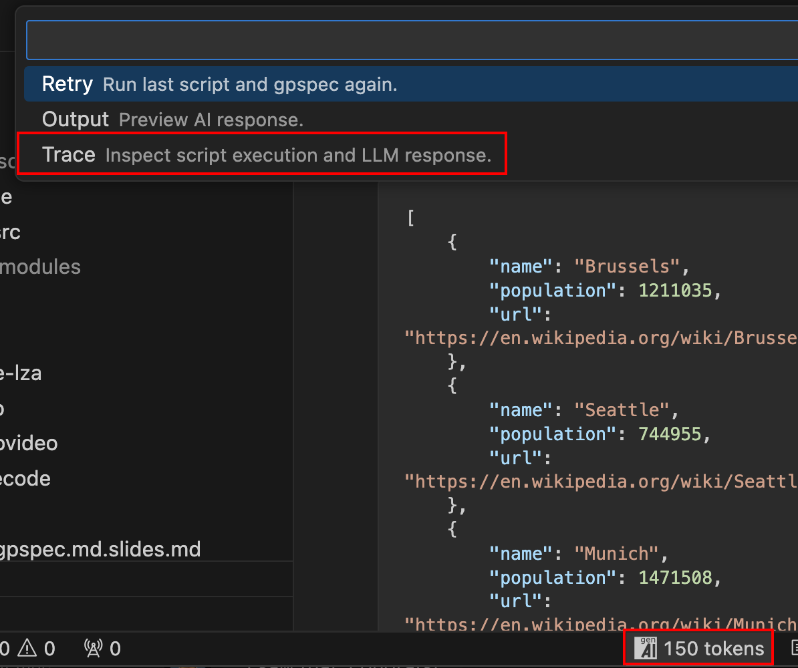

import copilotSrc from "../../../assets/chat-participant.png"
import copilotAlt from "../../../assets/chat-participant.png.txt?raw"
import { Image } from "astro:assets"

:::caution

Script are executed in the context of your environment.
**Only run trusted scripts.**

:::

## Visual Studio Code

In Visual Studio Code, the location where you start running a script determines the entries in the [`env.files`](/genaiscript/reference/scripts/context) variable.

### Single file

-   Right click on a file in the Explorer and select **Run GenAIScript...**.
-   Or right click in a file editor and select **Run GenAIScript...**.

The `env.files` array will contain a single element with the selected file.



### Folder

-   Right click on a folder in the Explorer and select **Run GenAIScript...**s.

The `env.files` array will contain all nested files under that folder.



:::tip[Root folder]

To run the script on the root folder, right click under the files.


:::

### GitHub Copilot Chat

You can run scripts in the [GitHub Copilot Chat](https://code.visualstudio.com/docs/copilot/getting-started-chat) through the [**@genaiscript**](/genaiscript/reference/vscode/github-copilot-chat) participant.

<Image src={copilotSrc} alt={copilotAlt} loading="lazy" />

### Default files

You can specify default file or files to run the script on.
When you run the script from the script file itself, or with the command line without file arguments,
the default files will be used.

```js
script({
    files: "path/to/files*.md",
})
...
```

## Command Line

Use the [run](/genaiscript/reference/cli/run) command to execute a script from the command line.

```sh
npx genaiscript run proofreader path/to/files*.md
```

## Tasks

The GenAIScript extension exposes each script as a [Task](https://code.visualstudio.com/docs/editor/tasks) automatically.

The task launches the [cli](/genaiscript/reference/cli) and runs the selected script and pass the path to the current opened editor.

-   Open the command palette `Ctrl+Shift+P` and search "Tasks: Run Task"
-   Select the `genaiscript` task provider
-   Select the script you want to run

:::note

When running a script as a task, the result will not be visible in the GenAIScript trace window.

:::

## Analyze results

By default, GenAIScript opens the output preview which shows a rendered view of the LLM output (assuming the LLM produces markdown).

The GenAIScript view provides an overview of the trace of the latest run.

You can also use the **Trace** to review the each transformation step of the script execution.

-   Click on the GenAIScript status bar icon and select **Trace**



## Next steps

[Debug](/genaiscript/getting-started/debugging-scripts) your scripts using the Visual Studio Code Debugger!
