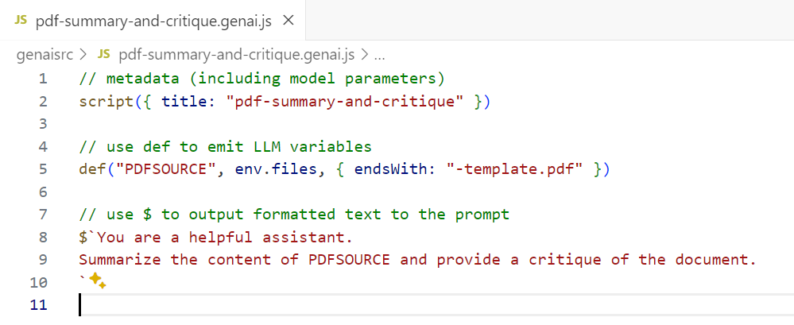
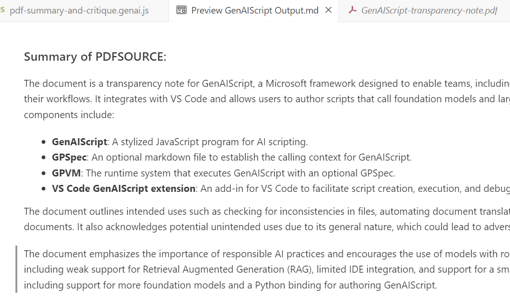

The quick-start guide illustrates how to write a GenAIScript that applies a LLM that understands
images to an image file.

1. Put your image in a directory visible in VS Code Explorer
2. Open the panel for GenAIScript (robot)
3. Create a GenAIScript from the menu with + button
   
4. Define and name the pdf file as an input:

```js
def("PDFSOURCE", env.files, { endsWith: ".pdf" })
```

4. Replace the text "TELL THE LLM WHAT TO DO..." with what you want it to do with your pdf file. Use the name in the def to refer to the file.

```js
// use $ to output formatted text to the prompt
$`You are a helpful assistant.
Summarize the content of PDFSOURCE and provide a critique of the document.
`
```

 5) Right click on the pdf document in VS Code Explorer. Select "Run GenAIScript". Select the script you just wrote. 6) Output will be displayed in a new buffer

