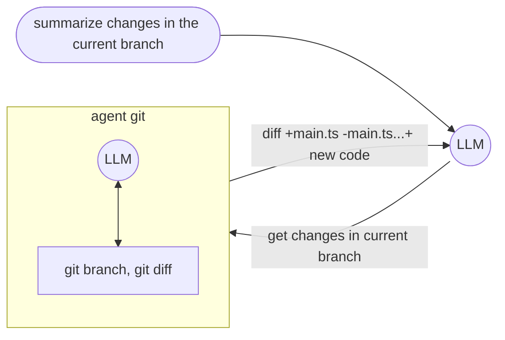
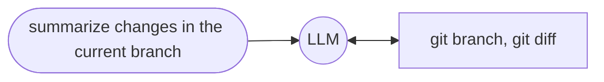
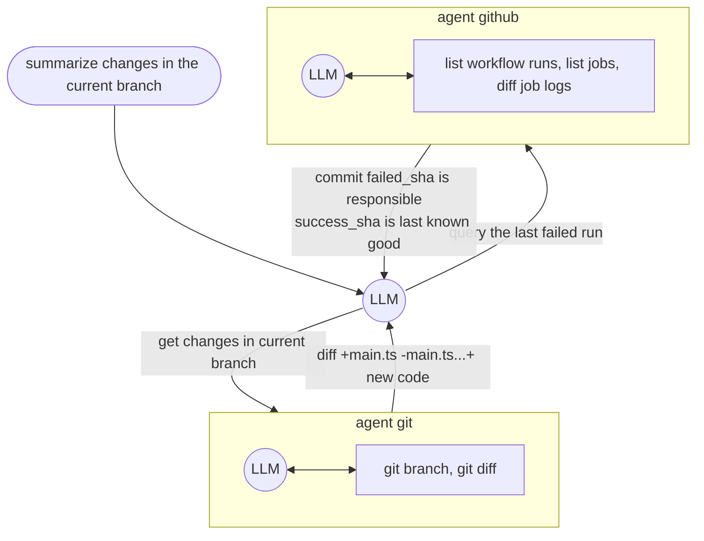
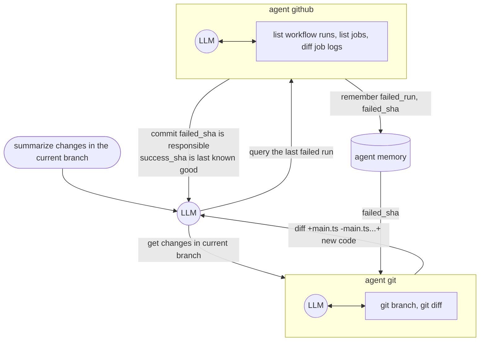

import { Content as BuiltinAgents } from "../../../../components/BuiltinAgents.mdx"

GenAIScript defines an **agent** as a [tool](/genaiscript/reference/scripts/tools) that
runs an [inline prompt](/genaiscript/reference/scripts/inline-prompts) to accomplish a task. The agent's LLM is typically augmented with
additional tools and a memory.

```js
script({
    // use all agents
    tools: "agent",
})

// agent git to get the commits
// agent interpreter to run python code
$`Do a statistical analysis of the last commits`
```

**GenAIScript does _not_ implement any agentic workflow or decision.**
It relies entirely on [tools](/genaiscript/reference/scripts/tools) support built into the LLMs.

## Agent = LLM + Tools

Let's take a look at the `agent_git` example that query a git repository. This agent is registered as a `tool` and can be used in the LLM prompt.
When the LLM needs information about something like "summarize changes in the current branch", it will call the `agent_git` tool with the query `get changes in the current branch`.

The `agent_git` tool itself has access to various git dedicated tools like `git branch`, `git diff` that it can use to solve.
It will have to resolve the current and default branch, compute a diff and return it to the main LLM.



## Agent vs Tools

Note that in this simple example, you could also decide to flatten this tree and give access to the git tools to the main LLM and skip the agent.



However, the agent abstraction becomes useful when you start to have too many functions or to keep the chat conversation length small as each agent LLM call gets "compressed" to the agent response.

## Multiple Agents

Let's take a look at a more complex example where multiple agents are involved in the conversation. In this case, we would like to investigate why a GitHub action failed.
It involves the `agent_git` and the `agent_github` agents. The `agent_github` can query workflows, runs, jobs, logs and the `agent_git` can query the git repository.



## Memory

All agents are equipped with a **memory** that allows them to share information horizontally across all conversations.

The memory is a log that stores all `agent / query / answer` interactions. When generating the prompt for an agent,
the memory is first prompted (using a small LLM) to extract relevant information
and that information is passed to the agent query.

```txt
ask agent about "query":
    wisdom = find info in memory about "query"
    agent answer "query" using your tools and information in "wisdom"
```



All agents contribute to the conversation memory and use the `agent_memory` tool unless it is explicitly disabled using `disableMemory`.

```js "disableMemory: true"
defAgent(..., { disableMemory: true })
```

## defAgent

The `defAgent` function is used to define an agent that can be called by the LLM. It takes a JSON schema to define the input and expects a string output. The LLM autonomously decides to call this agent.

```ts
defAgent(
    "git", // agent id becomes 'agent_git'
    "Handles any git operation", // description
    "You are a helpful expert in using git.",
    {
        tools: ["git"],
    }
)
```

-   the agent id will become the tool id `agent_<id>`
-   the description of the agent will automatically be augmented with information about the available tools

<BuiltinAgents />

## Example `agent_github`

Let's illustrate this by building a GitHub agent. The agent is a tool that receives a query and executes an LLM prompt with GitHub-related tools.

The definition of the agent looks like this:

```js wrap
defAgent(
    "github", // id
    "query GitHub to accomplish tasks", // description
    // callback to inject content in the LLM agent prompt
    (ctx) =>
        ctx.$`You are a helpful LLM agent that can query GitHub to accomplish tasks.`,
    {
        // list tools that the agent can use
        tools: ["github_actions"],
    }
)
```

and internally it is expanded to the following:

```js wrap
defTool(
    // agent_ is always prefixed to the agent id
    "agent_github",
    // the description is augmented with the tool descriptions
    `Agent that can query GitHub to accomplish tasks

    Capabilities:
    - list github workflows
    - list github workflows runs
    ...`,
    // all agents have a single "query" parameter
    {
        query: {
            type: "string",
            description: "Query to answer",
        },
        required: ["query"]
    },
    async(args) => {
        const { query } = args
        ...
    })
```

Inside callback, we use `runPrompt` to run an LLM query.

-   the prompt takes the query argument and tells the LLM how to handle it.
-   note the use of `ctx.` for nested prompts

```js wrap
        const res = await runPrompt(
            (ctx) => {
                // callback to inject content in the LLM agent prompt
                ctx.$`You are a helpful LLM agent that can query GitHub to accomplish tasks.`

                ctx.def("QUERY", query)
                _.$`Analyze and answer QUERY.
                - Assume that your answer will be analyzed by an LLM, not a human.
                - If you cannot answer the query, return an empty string.
                `
            }, , {
                system: [...],
                // list of tools that the agent can use
                tools: ["github_actions", ...]
            }
        )
        return res
```

## Selecting the Tools and System Prompts

We use the `system` parameter to configure the tools exposed to the LLM. In this case, we expose the GitHub tools (`system.github_files`, `system.github_issues`, ...)

```js wrap
            {
                system: [
                    "system",
                    "system.tools",
                    "system.explanations",
                    "system.github_actions",
                    "system.github_files",
                    "system.github_issues",
                    "system.github_pulls",
                ],
            }
```

This full source of this agent is defined in the [system.agent_github](/genaiscript/reference/scripts/system/#systemagent_github) system prompt.
