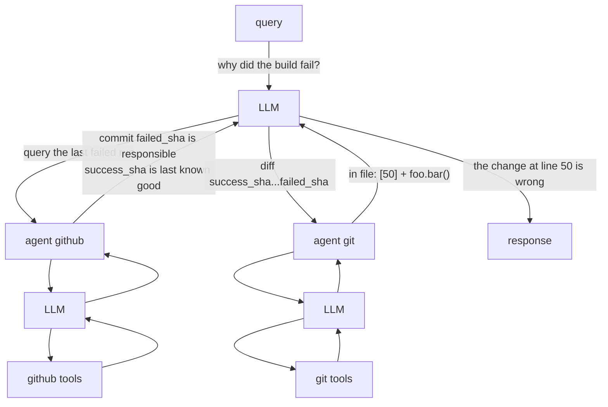

import { Content as BuiltinAgents } from "../../../../components/BuiltinAgents.mdx"

GenAIScript defines an **agent** as a [tool](/genaiscript/reference/scripts/tools) that
runs an [inline prompt](/genaiscript/reference/scripts/inline-prompts) to accomplish a task. The agent's LLM is typically augmented with
additional tools.

## Agent orchestration

**GenAIScript does _not_ implement any agentic workflow or decision.**
It relies entirely on [tools](/genaiscript/reference/scripts/tools) support built into the LLMs.



## defAgent

The `defAgent` function is used to define an agent that can be called by the LLM. It takes a JSON schema to define the input and expects a string output. The LLM autonomously decides to call this agent.

```ts
defAgent(
    "git", // agent id becomes 'agent_git'
    "Handles any git operation", // description
    "You are a helpful expert in using git.",
    {
        tools: ["git"],
    }
)
```

-   the agent id will become the tool id `agent_<id>`
-   the description of the agent will automatically be augmented with information about the available tools

<BuiltinAgents />

## Example `agent_github`

Let's illustrate this by building a GitHub agent. The agent is a tool that receives a query and executes an LLM prompt with GitHub-related tools.

The definition of the agent looks like this:

```js wrap
defAgent(
    "github", // id
    "query GitHub to accomplish tasks", // description
    // callback to inject content in the LLM agent prompt
    (ctx) =>
        ctx.$`You are a helpful LLM agent that can query GitHub to accomplish tasks.`,
    {
        // list tools that the agent can use
        tools: ["github_actions"],
    }
)
```

and internally it is expanded to the following:

```js wrap
defTool(
    // agent_ is always prefixed to the agent id
    "agent_github",
    // the description is augmented with the tool descriptions
    `Agent that can query GitHub to accomplish tasks

    Capabilities:
    - list github workflows
    - list github workflows runs
    ...`,
    // all agents have a single "query" parameter
    {
        query: {
            type: "string",
            description: "Query to answer",
        },
        required: ["query"]
    },
    async(args) => {
        const { query } = args
        ...
    })
```

Inside callback, we use `runPrompt` to run an LLM query.

-   the prompt takes the query argument and tells the LLM how to handle it.
-   note the use of `ctx.` for nested prompts

```js wrap
        const res = await runPrompt(
            (ctx) => {
                // callback to inject content in the LLM agent prompt
                ctx.$`You are a helpful LLM agent that can query GitHub to accomplish tasks.`

                ctx.def("QUERY", query)
                _.$`Analyze and answer QUERY.
                - Assume that your answer will be analyzed by an LLM, not a human.
                - If you cannot answer the query, return an empty string.
                `
            }, , {
                system: [...],
                // list of tools that the agent can use
                tools: ["github_actions", ...]
            }
        )
        return res
```

## Selecting the Tools and System Prompts

We use the `system` parameter to configure the tools exposed to the LLM. In this case, we expose the GitHub tools (`system.github_files`, `system.github_issues`, ...)

```js wrap
            {
                system: [
                    "system",
                    "system.tools",
                    "system.explanations",
                    "system.github_actions",
                    "system.github_files",
                    "system.github_issues",
                    "system.github_pulls",
                ],
            }
```

This full source of this agent is defined in the [system.agent_github](/genaiscript/reference/scripts/system/#systemagent_github) system prompt.
