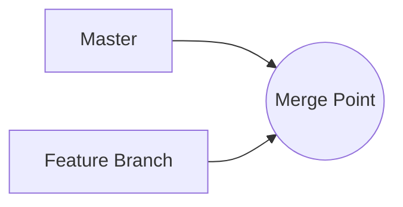
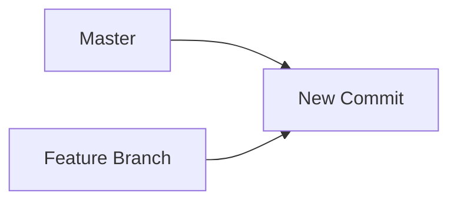

It is often useful to request an LLM to generate a diagram. Fortunately,
many LLMs already know [mermaid](https://mermaid.js.org/), a popular Markdown extension
to create diagrams and charts.

-   Install the [Markdown Preview Mermaid Support](https://marketplace.visualstudio.com/items?itemName=bierner.markdown-mermaid) extension for VS Code.

-   Mention `diagram` in the program or add `system.diagram` to the system prompt list.

```js
$`Generate a diagram of a merge.`
```

<!-- genaiscript output start -->

<details>
<summary>👤 user</summary>


```markdown wrap
Generate a diagram of a merge.
```


</details>


<details open>
<summary>🤖 assistant </summary>


````markdown wrap

````


</details>

<!-- genaiscript output end -->


The generated Markdown will appear as follows:

````markdown

````

and it gets rendered automatically once you install the extension.
