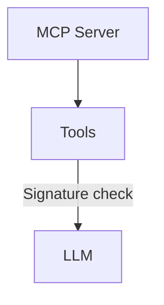
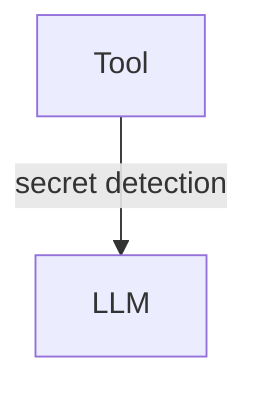
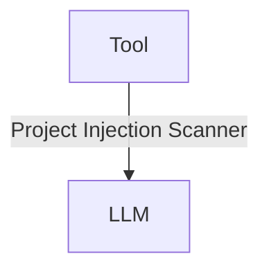
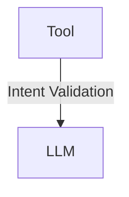

import { Image } from "astro:assets"
import { YouTube } from "astro-embed"
import logoPng from "../../../../assets/mcp.png"
import logoPngTxt from "../../../../assets/mcp.png.txt?raw"

<Image src={logoPng} alt={logoPngTxt} />

The [Model Context Protocol](https://modelcontextprotocol.io/) (MCP) defines a protocol that allows to share [tools](https://modelcontextprotocol.io/docs/concepts/tools)
and consume them regardless of the underlying framework/runtime.

**GenAIScript implements a client for MCP servers/tools**.

<YouTube id="https://youtu.be/q4Um2Mlvxy8" posterQuality="high" />

:::tip

GenAIScript also implements a server for MCP which exposes any script as a tool.
See [MCP server](/genaiscript/reference/scripts/mcp-server) for more details.

:::

## Configuring servers

You can declare the MCP server configuration in the `script` function (as tools or agents)
or load them dynamically using `defTool`.

### `mcpServers`

You can declare the MCP server configuration in the `mcpServers` field of `script` or `runPrompt`.
This is the same configuration as Claude configuration file.

```js "mcpServers:"
script({
    mcpServers: {
        memory: {
            command: "npx",
            args: ["-y", "@modelcontextprotocol/server-memory"],
        },
        filesystem: {
            command: "npx",
            args: [
                "-y",
                "@modelcontextprotocol/server-filesystem",
                path.resolve("."),
            ],
        },
    },
})
```

If you are looking for a subset of the tools, you can provide a list of tool ids.

```json '"tools": ["tool1", "tool2"]'
    mcpServers {
        "...": {
            "...": "...",
            "tools": ["tool1", "tool2"]
        }
    }
```

:::tip

See the [Security](#security) section for options to secure the use of MCP servers.

:::

### `mcpAgentServers`

The `mcpAgentServers` declares a set of MCP servers that will be wrapped into separate agents and injected in the tools list.
This is an efficient way to load and organize MCP servers as dedicated agents for specific tasks.

This is the same configuration with an additional `description` and optional `instructions` parameter.
The description is injected in the agent description, and the instructions are injected in the agent prompt.

```js
script({
    mcpAgentServers: {
        memory: {
            description: "A memory server",
            instructions: "Use this server to store and retrieve data.",
            command: "npx",
            args: ["-y", "@modelcontextprotocol/server-memory"],
        },
        filesystem: {
            description: "A filesystem server",
            instructions: "Use this server to read and write files.",
            command: "npx",
            args: [
                "-y",
                "@modelcontextprotocol/server-filesystem",
                path.resolve("."),
            ],
        },
    },
})
```

### `defTool`

You can use [defTool](/genaiscript/reference/scripts/tools) to declare a set of server configurations,
using the same syntax as in the [Claude configuration file](https://github.com/modelcontextprotocol/servers?tab=readme-ov-file#using-an-mcp-client).

```js
defTool({
    memory: {
        command: "npx",
        args: ["-y", "@modelcontextprotocol/server-memory"],
    },
    filesystem: {
        command: "npx",
        args: [
            "-y",
            "@modelcontextprotocol/server-filesystem",
            path.resolve("."),
        ],
    },
})
```

GenAIScript will launch the server and register all the tools listed by the server.
The tool identifier will be `server_tool_name` to avoid clashes.

:::tip

If your tool has a name that is not a valid identifier,
you can use the `["tool-name"]` syntax.

```js '["server-memory"]
defTool({
    ["server-memory"]: {
        ...
    },
})
```

:::

## Lifecycle of servers

Servers are started when rendering the prompt and stopped once the chat session is completed.

This means that if you define servers in an [inline prompt](/genaiscript/reference/scripts/inline-prompts),
the server will be started/stopped for each inline prompt.

## Finding servers

The list of available servers can be found in the [Model Context Protocol Servers project](https://github.com/modelcontextprotocol/servers).

## Security

[Model Context Protocol](https://modelcontextprotocol.io/) is a powerful protocol that also brings a number of security risks that one should be aware of.
GenAIScript implements various protection mechanisms to mitigate these risks. However, it is important to
understand the risks and how to use them.

### Dockerized packages

Many packages are available as Docker images. This is a good way to run a package in an isolated environment.
It also solves configuration/tool installation issues.

### Pinning package versions

You can pin the version of the MCP server executed with `npx` or other package managers.
This is a good way to ensure that the server is not updated to a new version that may break your script
or introduce a vulnerability.

```js '@0.6.2'
script({
    mcpServers: {
        memory: {
            command: "npx",
            args: ["-y", "@modelcontextprotocol/server-memory@0.6.2"],
        },
    },
})
```

### Validating Tools signature

GenAIScript supports setting the `signature` of the tools declared by a server. If the tools signature does not match,
GenAIScript will refuse to load the server (and throw an error).



This prevents **rug pull attacks**, where a MCP server would change the tools
based on some external condition (e.g. running a second time).

To enable this feature, you first want to set `toolsSha` to a empty value to trigger the validation.

```js 'toolsSha: ""'
script({
    mcpServers: {
        playwright: {
            ...,
            toolsSha: ""
        }
    }
})
```

Then run your script and it will fail to load the MCP server. The terminal log will contain the computed
signature of the tools and a cached file with the tools content so that you can review it further.
If everything looks ok, you can set the signature to `toolsSha` and run the script again.

```js 'toolsSha: ""'
script({
    mcpServers: {
        playwright: {
            ...,
            toolsSha: "52cf857f903...72ab44a5"
        }
    }
})
```

### Secret Detection in Tool Outputs

A tool may accidentally read a secret from the environment or from the input.
For example, a tool that fetches a URL may return a page that contains a secret.



To prevent this, the [secret scanner](/genaiscript/reference/scripts/secret-scanning)
on all tool outputs.

### Prompt Injection in Tool Outputs

A tool may return data that contains prompt injection attacks.
For example, a tool that fetches a URL may return a page that contains prompt injection attacks.



To prevent this, you can enable the `detectPromptInjection` option. It will run your [content safety scanner](/genaiscript/reference/scripts/content-safety) services
on the tool output and will erase the answer if an attack is detected.

```js 'detectPromptInjection: "always"'
script({
    mcpServers: {
        playwright: {
            ...,
            detectPromptInjection: "always"
        }
    }
})
```

## Tool Output Intent validation

You can configure GenAIScript to execute a LLM-as-a-Judge validation of the tool result based on the description or a custom intent.
The LLM-as-a-Judge will happen on every tool response using the `intent` model alias, which maps to `small` by default.



The `description` intent is a special value that gets expanded to the tool description.

```js
mcpServers: {
    playwright: {
        command: "npx",
        args: ["--yes", "@playwright/mcp@latest", "--headless"],
        intent: "description",
    },
},
```
