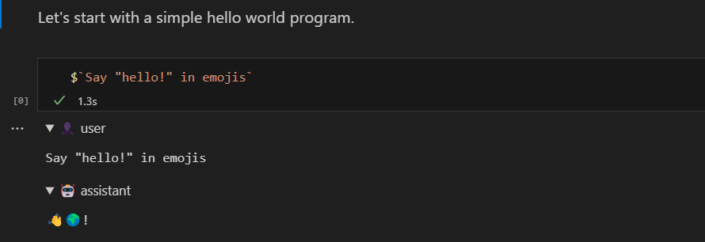

import { Steps } from "@astrojs/starlight/components"

The GenAISCript Markdown Notebook is currently used to author the GenAIScript documentation. 



It allows to run script snippets and inline the result in the markdown just like this:

```js system="false" user="true" wrap
$`Write a 3 emoji story.`
```

{/* genaiscript output start */}

<details open>
<summary>👤 user</summary>


```markdown wrap
Write a 3 emoji story.
```


</details>


<details open>
<summary>🤖 assistant</summary>


```markdown wrap
🌱 🌻 🌞
```


</details>

{/* genaiscript output end */}


## Edit Markdown as Notebook

The first step is to open the markdown file to edit using the GenAIScript notebook.

<Steps>

1.   In Visual Studio Code, right click on any Markdown (`.md`) or MDX file (`.mdx`)
2.   Select **Open With...**
3.   Select **GenAIScript Markdown Notebook**

</Steps>

## Run snippets

You can run any **JavaScript** cell by clicking the **Run Cell** button or pressing `Shift+Enter`. It will run the code as if it was a GenAIScript script in the workspace.
```js
$`Write a one sentence poem.`
```

{/* genaiscript output start */}

<details>
<summary>👤 user</summary>


```markdown wrap
Write a one sentence poem.
```


</details>


<details open>
<summary>🤖 assistant</summary>


```markdown wrap
In the still of the night, the stars whisper secrets to the dreaming earth.
```


</details>

{/* genaiscript output end */}


:::note

The chat message log (`system`, `user`, `assistant`, ...) was generated and inserted using a notebook.

:::

## Page Configuration

You can provide global configuration settings in the front matter. The front matter starts and ends with three dashes `---` and is located at the top of the markdown file.

```md
---
title: My genai notebook
genaiscript:
  model: openai:gpt-3.5-turbo
  ...
---
```

### Model, temperature, ...

You can specify the LLM configuration metadata from `script`.

```md
---
genaiscript:
   model: openai:gpt-3.5-turbo
   temperature: 0
---
```

### Files

You can specify the files to include in the notebook, as a single entry or an array. Globs are supported. 
The files are relative to the workspace root.

```md
---
genaiscript:
  files: src/samples/*.md
---
```

The `env.files` variable is available to reference the files in the notebook.

```js
def("FILE", env.files)
$`Summarize FILE using exclusively emojis.`
```

{/* genaiscript output start */}

<details>
<summary>👤 user</summary>


``````markdown wrap
FILE:
`````md file="src/samples/markdown.md"
---
title: What is Markdown? - Understanding Markdown Syntax
description: Learn about Markdown, a lightweight markup language for formatting plain text, its syntax, and how it differs from WYSIWYG editors.
keywords: Markdown, markup language, formatting, plain text, syntax
sidebar: mydoc_sidebar
---
What is Markdown?
 Markdown is a lightweight markup language that you can use to add formatting elements to plaintext text documents. Created by John Gruber in 2004, Markdown is now one of the world’s most popular markup languages. 

Using Markdown is different than using a WYSIWYG editor. In an application like Microsoft Word, you click buttons to format words and phrases, and the changes are visible immediately. Markdown isn’t like that. When you create a Markdown-formatted file, you add Markdown syntax to the text to indicate which words and phrases should look different.

For example, to denote a heading, you add a number sign before it (e.g., # Heading One). Or to make a phrase bold, you add two asterisks before and after it (e.g., **this text is bold**). It may take a while to get used to seeing Markdown syntax in your text, especially if you’re accustomed to WYSIWYG applications. The screenshot below shows a Markdown file displayed in the Visual Studio Code text editor....
`````

Summarize FILE using exclusively emojis.
``````


</details>


<details open>
<summary>🤖 assistant</summary>


```markdown wrap
📝 Markdown is a lightweight markup language created by John Gruber in 2004. It allows users to add formatting to plaintext documents using simple syntax. Unlike WYSIWYG editors, Markdown requires users to add specific symbols to indicate formatting, such as using # for headings and ** for bold text. Despite the initial adjustment period, Markdown has become one of the most popular markup languages in the world.
```


</details>

{/* genaiscript output end */}


