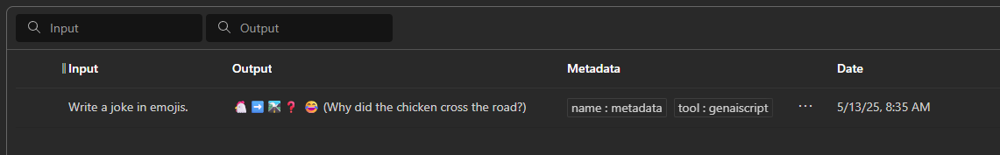

Metadata is a map of key-value pairs used to enable stored completions — a feature in OpenAI and [Azure OpenAI](https://learn.microsoft.com/en-us/azure/ai-services/openai/how-to/stored-completions) that allows you to store and retrieve completions for a given prompt. This is useful for distillation and evaluation purposes.



```js
script({
    metadata: {
        name: "my_script",
    },
})
```

You can attach up to 16 key-value pairs to an object. This is useful for storing additional information in a structured format and for querying objects via the API or dashboard.

Keys are strings with a maximum length of 64 characters. Values are strings with a maximum length of 512 characters.
