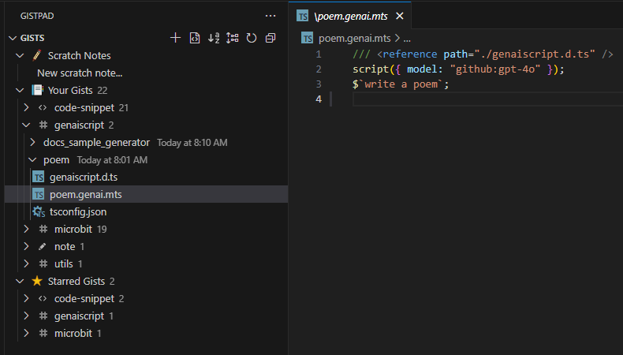

[GitHub Gists](https://gist.github.com/) are a simple way to share code snippets and notes with others.
They are essentially Git repositories that can be created and shared easily.
Gists can be public or secret, and they support versioning, making them a great tool for collaboration.



## Running GenAIScript from Gists

GenAIScript supports the following URL formats to run scripts directly from a gist.

- `gist://<gist id>/<file name>`
- `vscode://vsls-contrib.gistfs/open?gist=<gist id>&file=<file>`

```sh
genaiscript run gist://8f7db2674f7b0eaaf563eae28253c2b0/poem.genai.mts
```

The gist file is cached locally in `.genaiscript/resources` then executed. If available,
it uses the GitHub login information to access private gists.

:::caution

GenAIScript are JavaScript files so make sure you run gists you trust.

:::

## GistPad in Visual Studio code

The [GistPad extension](https://marketplace.visualstudio.com/items?itemName=vsls-contrib.gistfs)
for Visual Studio Code allows you to create, edit, and manage gists directly from your editor.

You can open a file in a Gist and run it using the `genaiscript` command.

### Type Checking

To get type checking working, we need to upload the `genaiscript.d.ts` to the gist and setup a reference to it
by adding this comment **at the top of the file**:

```js
/// <reference path="./genaiscript.d.ts" />
```

This can be done automatically:

- right click on the Gist GenAIScript file
- select `GenAIScript: Fix Type Definitions`
- You might be prompted to allow GenAIScript to use your GitHub account. GenAIScript will request a token with `gist` scope to upload the missing files.

In order to load the GenAIScript types, you'll need to "nudge" the TypeScript compiler:

- open the `genaiscript.d.ts` file from the GistPad tree (this loads the types in memory)
- open your GenAIScript file in the GistPad tree and it should have type checking!

## Limitations

Since the GistPad extension is not a full-fledged IDE, there are some limitations to be aware of:

- imports will probably not resolve
