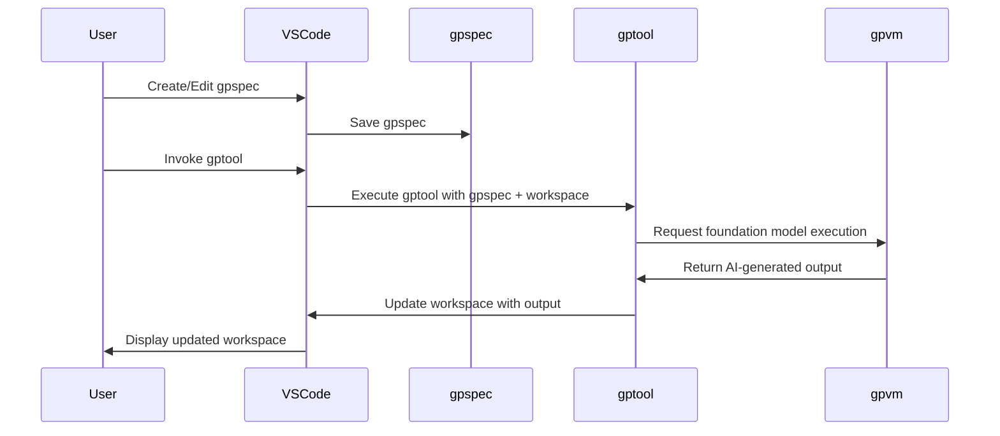
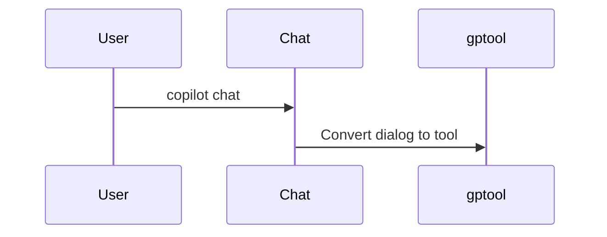

# Visual Studio Code Extension

## User experience

This diagram demonstrates the AI-enhanced workflow process in gptools. The gpspec starts the `gptool`, which reads the `gpspec`, interacts with the gpvm and foundation model.
The AI-generated output is used to update the workspace, and the user interacts with the updated workspace through the gptools extension to VS code.

## Copilot Chat integration

This diagram demonstrates the AI-enhanced workflow process in gptools. The user interacts with the chatbot, which converts the dialog to a `gptool`.

## Getting started

### Install in Visual Studio Code

These are the instructions to install the latest build of the extension manually in Visual Studio Code.

-   install [Visual Studio Code](https://code.visualstudio.com/Download) or [Visual Studio Code Insiders](https://code.visualstudio.com/insiders/. The Insiders version gives you access the Copilot Chat integration.
-   open the [latest release](https://github.com/microsoft/gptools/releases/latest/),
-   download the `gptools.vsix` file (`gptools.insiders.vsix` for Insiders) into your project
-   open Visual Studio Code
-   right click on the `.vsix` file and select **Install Extension VSIX...**

Until this extension is in the Marketplace, you will have to repeat these steps each time you want to upgrade the extension.

### Try a builtin tool

GPTools comes with sample tools and you don't need a gpspec to run those tools on any file. The easiest way to start playing with GPTools is to:

-   open a folder in Visual Studio Code
-   open any file, open the context menu and run "Run GPTool..."
-   select one of the builtin tools in the dropdown

### Create a gpspec

The default gpspec generated by GPTools is rather simplistic. You can improve the performance of the LLM
by creating a new gpspec with more instructions.

### Fork a tool

-   open the command palette
-   type "Fork a GPTool..." and select the tool you want to fork
-   pick a new name and start editing the tool

The tool will be available in the dropdown of the "Run GPTool..." command.
