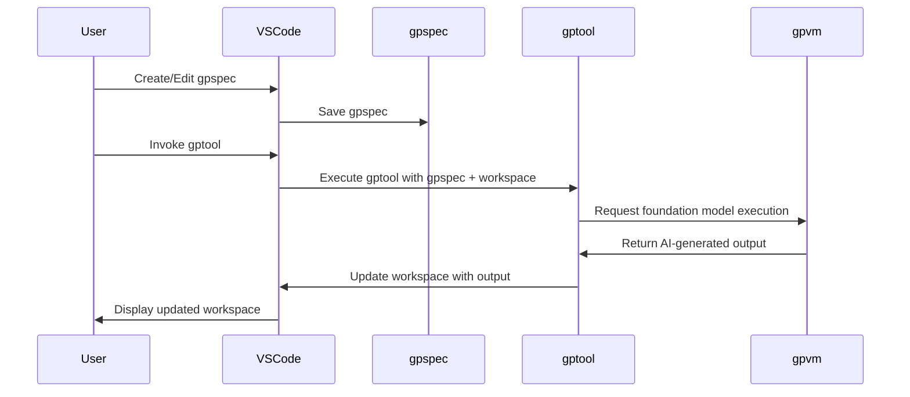

# Visual Studio Code Extension

## User experience

This diagram demonstrates the AI-enhanced workflow process in gptools. The gpspec starts the `gptool`, which reads the `gpspec`, interacts with the gpvm and foundation model.
The AI-generated output is used to update the workspace, and the user interacts with the updated workspace through the gptools extension to VS code.



## Copilot Chat integration

GenAIScript is exposed as the `@gptools` agent in Copilot Chat

### Chat REPL

When invoking the @gptools agent without a subcommand, the agent will aggregate the conversation
into a gptool script and execute it. This is a great way to explore the capabilities of GenAIScript
and interactively create a new gptool script.

### Tools as slash commands

Each `gptool` is exposed as a sub command
using the tool id, e.g. the file name.

> [!IMPORTANT]
> Copilot Chat is currently a proposed API and requires Visual Studio Code Insiders.

For example, to run the `front-matter` tool on the current file, type in the Copilot chat:

```bash
@gptool /front-matter
```

When invoked from Copilot Chat, the `env.chat` variable is populated and contains the history of messages
and the prompt passed by the user after the slash command.

### Create a gpspec

The default gpspec generated by GenAIScript is rather simplistic. You can improve the performance of the LLM
by creating a new gpspec with more instructions.

### Fork a tool

-   open the command palette
-   type "Fork a GenAiScript..." and select the tool you want to fork
-   pick a new name and start editing the tool

The tool will be available in the dropdown of the "Run GenAiScript..." command.
