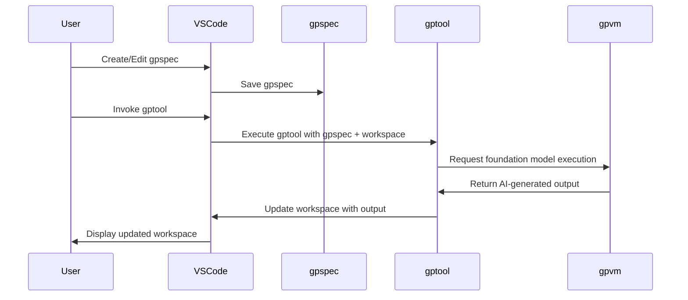

### GPTools - AI-Enhanced Workflows for Teams

- GPTools is a framework that empowers teams to create and use AI-enhanced scripts.
- It combines traditional code and natural language.

---

### Key Objectives and Technical Elements

- Improve automation, collaboration, and accessibility.
- Key elements: gptools, gpspecs, VS Code extension, gpvm.

---

### Install manually

- Open the latest release.
- Download the `gptools.vsix` file.
- Install the extension in Visual Studio Code.

---

### GPTool scripts

- GPTool scripts use stylized JavaScript.
- They are stored as files in your project.

---

```js
gptool({
    title: "Technical proofreading",
    description: "Reviews the text as a technical document writer.",
})

def("TEXT", env.file)

$`You are reviewing and updating TEXT to fix grammatical errors, 
fix spelling errors and make it technical.`
```

---

### GPSpec specifications

- Natural language documents that instantiate gptools in a particular context.
- GPTools parses `*.gpspec.md` markdown files as specification.

---

```markdown
# email address recognizer

Write a function that takes a string argument
and returns true if the whole string is a valid email address, false otherwise.
```

---

### User experience

- The gpspec starts the `gptool`, which reads the `gpspec`, interacts with the gpvm and foundation model.
- The AI-generated output is used to update the workspace.

---



---

### Contributing

- We accept contributions!
- Checkout the [CONTRIBUTING](./CONTRIBUTING.md) page for details and developer setup.

---

### Trademarks

- This project may contain trademarks or logos for projects, products, or services.
- Use of Microsoft trademarks or logos in modified versions of this project must not cause confusion or imply Microsoft sponsorship.

