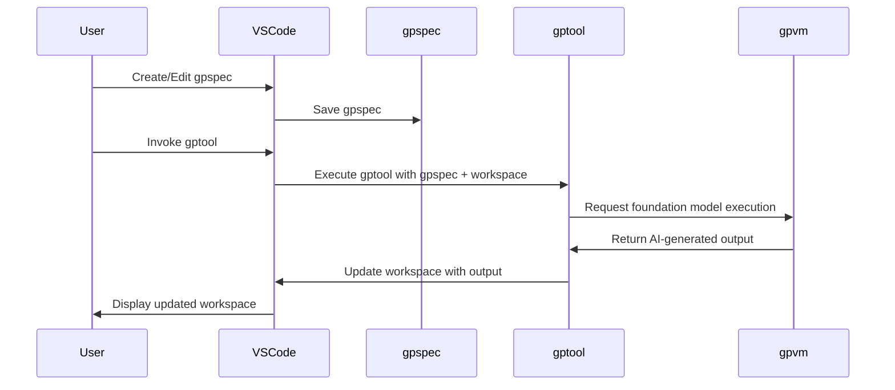

### GPTools - AI-Enhanced Workflows for Teams

- GPTools allows teams to create and use AI-enhanced scripts.
- The framework leverages LLMs to combine traditional code and natural language.

---

### Key Objectives and Technical Elements

- Improve automation, collaboration, and accessibility in GPT artifacts.
- Key elements: gptools, gpspecs, VS Code extension, gpvm.

---

### GPTool Scripts

- GPTool scripts use stylized JavaScript with minimal syntax.
- Stored as files (`gptools/*.gptool.js`) in your project.

---

### GPTool Script Example

```js
gptool({
    title: "Technical proofreading",
    description: "Reviews the text as a tech writer.",
})

def("TEXT", env.file)

$`You are reviewing and updating TEXT 
to fix grammatical errors, 
fix spelling errors and make it technical.`
```

---

### GPSpec Specifications

- Natural language documents that instantiate gptools in a particular context.
- GPTools parses `*.gpspec.md` markdown files as specification.

---

### GPSpec Example

```markdown
# email address recognizer

Write a function that takes a string
and returns true if the whole string is a valid email address,
false otherwise.
```

---

### User Experience

- The gpspec starts the `gptool`, which reads the `gpspec`, interacts with the gpvm and foundation model.
- The AI-generated output is used to update the workspace.

---

### User Experience Diagram



---

### Getting Started

- Install in Visual Studio Code.
- Try a builtin tool.
- Create a gpspec.
- Fork a tool.

### Trademarks

- This project may contain trademarks or logos for projects, products, or services.
- Use of Microsoft trademarks or logos in modified versions of this project must not cause confusion or imply Microsoft sponsorship.

