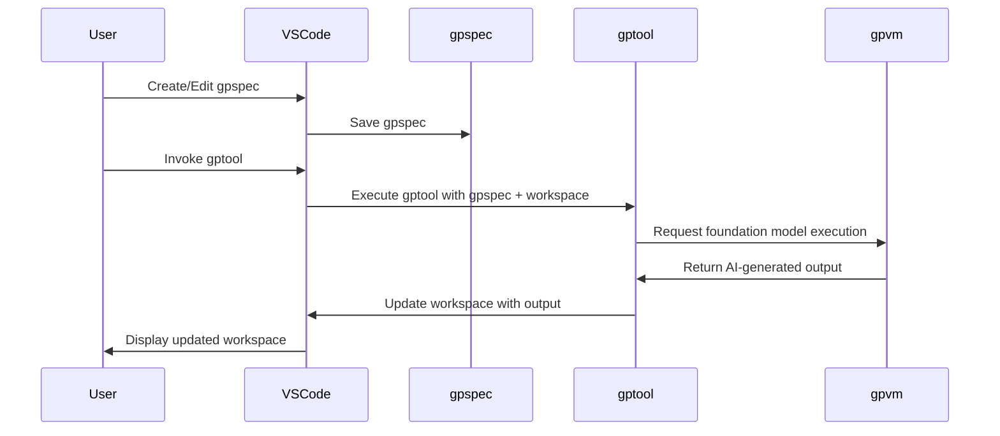

# GPTools

AI-Enhanced Workflows for Teams.

https://github.com/microsoft/gptools/assets/4175913/bbee1282-0591-4c06-a04e-4062af737523

## Features

GPTools lets you apply AI transformation to various parts of your project
while taking into account the tree structure of your documents.

-   **\*.gptools.js**: Scripts that integrate traditional code and natural language, leveraging foundation models in their execution.
-   **\*.gpspecs.md**: Natural language documents that instantiate gptools in a particular context.
-   **gpvm**: A framework and runtime system that executes gpspecs and gptools.

### GPTool scripts

GPTool scripts use stylized JavaScript with minimal syntax. They are stored as files (`gptools/*.gptool.js`) in your project.

```js
gptool({
    title: "Technical proofreading",
    description: "Reviews the text as a technical document writer.",
})

def("TEXT", env.file)

$`You are reviewing and updating TEXT to fix grammatical errors, fix spelling errors and make it technical.`
```

GPTools comes with builtin tools and allows you to fork and customize the AI prompts to your project specific needs.
This leverages VSCode language support (completion, coloring, error checking)
while remaining friendly to people not very familiar with JavaScript.
GPTools also provides detailed expansion logs to help you debug your templates.

Since gptool scripts are stored as files in the project, they can be shared, versioned, collaborated on by the entire development team
using the existing team development cycle.

In the future, we foresee that developers will create libraries of gptools and share them as libraries on their favorite package manager.

### GPSpec specifications

GPTools parses `*.gpspec.md` markdown files as specification.

```markdown A sample GPSpec document.
# email address recognizer

Write a function that takes a string argument
and returns true if the whole string is a valid email address, false otherwise.
```

### User experience



This diagram demonstrates the AI-enhanced workflow process in gptools. The gpspec starts the `gptool`, which reads the `gpspec`, interacts with the gpvm and foundation model. The AI-generated output is used to update the workspace, and the user interacts with the updated workspace through the gptools extension to VS code.

### Samples

The extension contains a few gptools, and the following samples can also be consulted.

-   [hello world](https://github.com/microsoft/gptools/tree/main/packages/helloworld)

## Authoring GPSpecs

To start using GPTools, create a new `.gpspec.md` file and start adding content as markdown. You can use the CodeAction QuickFix light bulb to launch the gptools on this file.

```markdown A sample CoArch document.
# email address recognizer

Write a function that takes a string argument and returns true if the whole string is a valid email address, false otherwise.

...
```

When an AI transformation is computed, a refactoring code preview will be shown to confirm the changes. Click on each line of the change tree to see individual diff views. This is the same user experience as a refactoring.

You can accept or cancel the changes using the buttons at the bottom of the view.

### GPSpec Refinement

If you need to "influence" the answer of the LLM, you can click on the **Refine GPSpec** button in the status dialog (click on the statub bar icon) to refine the gpspec file
by adding a line. This flow provides an iterative, chat like experience to evolve your gpspec file.

### Running next GPTool

Once you have used a GPTool on a GPSpec file, this file becomes the "active GPSpec"
and you can use the GPTools status bar to launch the next GPTool without having
to open the gpspec file.

## OpenAI or Llama Token

GPTools will automatically ask you for a token when needed and will store it in the workspace secret storage. The token is **never** stored in the clear or shared outside the project.

<!-- Requesting the OpenAI request](./images/token.png) -->

The token will be cleared once we detect it expired; but you can also _forget_ the token by using the `GPTools - Clear OpenAI Token` command.

<!-- Command to clear the token](./images/cleartoken.png) -->

Following token formats are supported:

-   `sk-???` will use https://api.openai.com/v1/
-   `https://???.openai.azure.com#key=???` will use Azure OpenAI endpoint
-   in fact, `https://???.???#key=???` will also assume Azure OpenAI endpoint
-   you can also paste a `curl` or similar invocation and we'll try to parse it out
-   if you use `https://???.???#tgikey=???` we'll assume
    [HuggingFace Text Generation Inference](https://github.com/huggingface/text-generation-inference),
    currently only Llama Instruct models are supported; the key is sent as `api-key` header

## Authoring GPTool scripts

GPTools has a text template engine that is used to expand and assemble prompts before being sent to OpenAI. These templates can be forked and modified.

All prompts are JS files named as `*.gptool.js`. You can use the `GPTools - Fork a gptool...` to fork any known prompt.

All `system.*.gptool.js` are considered system prompt templates
and are unlisted by default. There is no variable expansion in those.

### Example

```js
gptool({
    title: "Shorten", // displayed in UI
    // also displayed, but grayed out:
    description:
        "A prompt that shrinks the size of text without losing meaning",
    categories: ["shorten"], // see Inline prompts later
})

// this appends text to the prompt
$`Shorten the following FILE. Limit changes to minimum.`

// you can debug the generation using goo'old logs
console.log({ fragment: env.file })

// this is similar to $`SUMMARY: ${env.fragment}`
// but the variable is appropriately delimited
def("FILE", env.file)

// more text appended to prompt
$`Respond with the new FILE.`
```

### Metadata

Prompts use `gptool({ ... })` function call
to configure the title and other user interface elements.

```js
gptool({
    title: "Shorten", // displayed in UI
    // also displayed, but grayed out:
    description:
        "A prompt that shrinks the size of text without losing meaning",
    categories: ["shorten"], // see Inline prompts later
})
```

#### title: string

`title` is used as the prompt name, displayed in the light-bulb UI

```js
gptool({ title: "Shorten" })
```

#### description: string

`description` provides more details and context about the prompt.

```js
gptool({
    title: "Shorten",
    description:
        "A prompt that shrinks the size of text without losing meaning.",
})
```

#### system: prompt_template_id[]

Override the system prompts with a custom prompt.

```js
gptool({
    title: "Generate code",
    system: ["system.code"],
})
```

#### outputFolder

You can specify an output folder using `outputFolder` in the script.

```js
gptool({
    ...,
    outputFolder: "src",
})
```

You can specify the output folder using `system.multifile.outputFolder` variable in the gpspec file.

```markdown
<!-- @system.files.outputFolder

mysrc

-->
```

#### readClipboard

The prompt will read the clipboard and use it as the input. Running the prompt might trigger a dialog to request clipboard access.

```js
gptool({
    ...,
    readClipboard: true,
})
```

#### LLM parameters

These are taken from prompt, or from system prompt, or set to default.

-   `temperature: 1`, makes the model more "creative", defaults to 0.2
-   `model: "gpt-4"`, changes default model
-   `maxTokens: 800`, sets the maximum response size

#### Other parameters

-   `unlisted: true`, don't show it to the user in lists. Template `system.*` are automatically unlisted.

See `gptools.d.ts` in the sources for details.

### Logging

Use `console.log` and friends to debug your prompts.

### Variable Expansion

Variables are referenced and injected using `env.variableName` syntax.

When you apply a prompt to a given fragment, a number of variables are set including

-   `env.fence` set to a suitable fencing delimiter that will not interfere with the user content delimiters.
-   `env.links` set of linked files and content

> For a full list with values, run any prompt, click on the "CoArch" in the status bar and look at prompt expansion trace.

#### Fenced variables

As you expand user markdown into your prompt, it is important to properly fence the user code, to prevent (accidental) prompt injection and confusion.

The `env.fence` variable is set to a suitable fencing delimiter that will not interfere with the user content delimiters.

```js
$`
${env.fence}
${env.fragment}
${env.fence}
`
```

The `def("SUMMARY", env.fragment)` is a shorthand to generate a fence variable output.
The "meta-variable" (`SUMMARY` in this example) name should be all uppercase (but can include
additional description, eg. `"This is text before SUMMARY"`).

```js
def("SUMMARY", env.fragment)

// approximately equivalent to:

$`SUMMARY:`
fence(env.fragment)

// approximately equivalent to:

$`SUMMARY:
${env.fence}
${env.fragment}
${env.fence}
`
```

#### Linked files

When the markdown references to a local file, the link name and content will be available through `env.links`

```js
Use documentation from DOCS.

def("DOCS", env.links.filter(f => f.filename.endsWith(".md")))
```

In the coarch files, those link you be part of a bulletted list.

#### Current file

The current file is also available as a linked file through, `env.file`

#### fetchText(ur: string | LinkedFile): Promise<{ ok: boolean; status: number; statusText: string; text?: string; file: LinkedFile }>

Use `fetchText` to to issue GET requests and download text from the internet.

```ts
const { text, file } = await fetchText("https://....")
if (text) $`And also ${text}`

def("FILE", file)
```

### Conditional expansion

You can use regular JavaScript `if` statements.

```js
if (env.output) def("CODE", env.output)
```

### Inline variable

You can inject custom variables in the process by authoring them as markdown comments in your `.gpspec.md` files. The variable are accessible through the `env.vars` field.

```markdown
Lorem ipsum...

<!-- @myvar

myvalue
-->
```

And somewhere in the prompt

```js
const myvalue = env.vars["myvar"]
```

### Inline prompts

You can inject prompt in the process by authoring them as markdown comments in your `.gpspec.md` files. Essentially, you are defining variables that will be expanded in the prompt templates.

This example defines a prompt instruction that will be injected in all prompts (that refer to that variable).

```markdown
Lorem ipsum...

<!-- @prompt

Avoid acronyms.
-->
```

Another prompt just for the summaries.

```markdown
Lorem ipsum...

<!-- @prompt.summarize
Keep it short.
-->
```

The prompts have to reference the variable, that is the `summarize.gptool.js` has to include `"summarize"`
as one of it's `categories` (otherwise, only `@prompt` is inserted).
The expansion of these variables is scoped. If you include `"bar.baz"` category,
it will insert variables `{{@prompt}}`, `{{@prompt.bar}}`, and `{{@prompt.bar.baz}}` (in this order, skipping any missing variables).

The inline prompts have to occur at the end of the body of a fragment.

```markdown
# Image resize {#OI62}

A command line that takes a file name, a size, and an output file name, resizes the image using the best algorithm, and saves the resized image. Use node.js LTS.

<!-- @prompt

Use the writing style of software technical writer.

-->
```

## Settings

The Visual Studio Code extension has various configuration settings:

### `max cached temperature`

This setting controls the threshold to disable caching for prompts with high temperature; since the temperature increases the randomness
of the response. Default is `0.1`.
