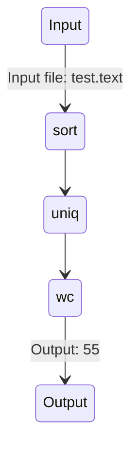

### Introduction

- gptools: AI-Enhanced Tools for Human Workflows
- Empower teams with AI-enhanced scripts

---

### Key Components

- gptools: Scripts with code and natural language
- gpspecs: Instantiate gptools in context
- gpvm: Executes gpspecs and gptools
- VS code extension: Seamless user interaction

---

### Heilmeier Catechism

- Goal: Empower teams with AI-enhanced tools
- Current limitations: Manual processes, AI model limitations
- New approach: Combine code and natural language

---

### Who Cares?

- Developers and non-developers
- Organizations seeking improved workflows
- Automation of previously impossible tasks

---

### Potential Impact

- Transform AI-enhanced application development
- Enable non-developers to automate workflows
- Foster new generation of AI-enhanced applications

---

### Risks and Payoffs

- Risks: AI model mistakes, decision-making transparency
- Payoffs: Democratization of AI-enhanced tools

---

### Cost and Timeline

- Cost: Development, maintenance, AI model resources
- Timeline: Depends on complexity, adoption, customization

---

### Success Metrics

- Midterm: Develop and integrate gptools, gpspecs, VS code extension
- Final: Widespread adoption, customization, AI-enhanced applications
- Standard markdown file with additional elements
- Links to context elements and natural language for specific tasks

---

# gptools Extension to VS Code
- Command palette for selecting gptools
- Token management system for AI model connection
- Runtime environment for executing gptools and processing results
- User interface for refining results and viewing gptool trace

---

# Implications of gptools
- Transformative for AI-enhanced applications
- Empowers non-developers to automate workflows
- Fosters a new generation of AI-enhanced applications
- Opportunities for customization and authoring at various expertise levels
