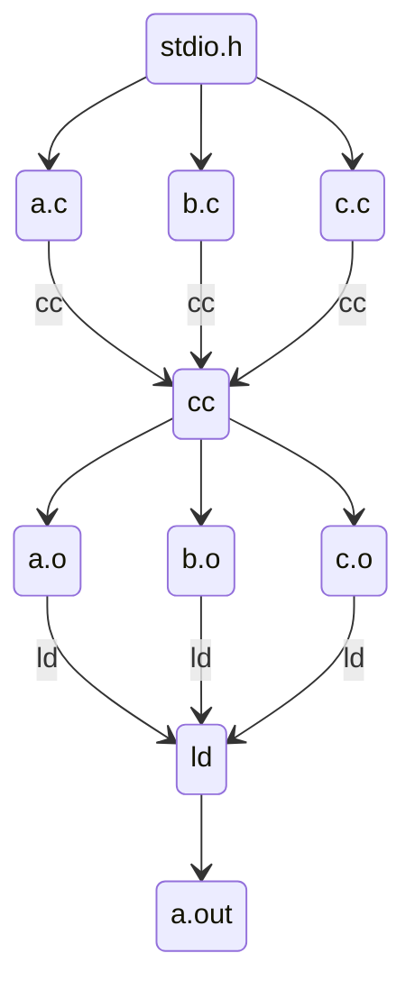
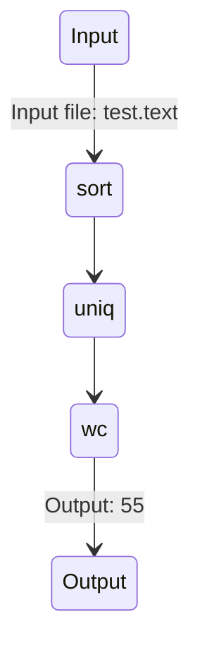

# gptools: Empowering Human Workflows with AI-Enhanced Tools

-   Authors: Peli de Halleux, Michał Moskal, Ben Zorn
-   Date: October 2023

## Complex Artifacts Require Complex Workflows

-   Software development is a complex process that requires the coordination of many different activities.
-   Historically, software development has been a highly manual process, with developers using a variety of tools to create and maintain the artifacts that comprise a software system.
-   Over time abstractions have been developed to help manage the complexity of software development.
    -   Important examples include: Unix utilities and pipes, makefiles, build scripts, etc.
-   Modern software development includes many automated processes as well as manual processes such as code review, design review, bug triage, etc.

## Foundation Models Create New Opportunities

-   The recent development of foundation models (aka LLMs) have created new opportunities for automating complex workflows.
-   AI has important advantages over traditional software:
    -   AI models can perform tasks normal software cannot
    -   AI models can be instructed using natural language, allowing non-programmers to use them
-   AI models also have disadvantages:
    -   AI models are not perfect, and can make mistakes
    -   AI models are not transparent, and it is difficult to understand why they make the decisions they do
-   AI models are best used to augment human workflows, not replace them

## gptools - a Framework for AI-Enhanced Workflows

Vision: empower teams, including non-developers, to use AI-enhanced scripts to support their efforts to create, understand, and maintain complex artifacts

Goals: support tool abstraction, modularity, reuse, but at the same time empower non-developers to author, maintain, and update AI-enhanced scripts

Approach: Foundation models enable a new kind of scripting that allows script writers to achieve both greater functionality and greater ease of use. We separate scripts into two related parts: a generic reusable _gptool_ and a natural language _gpspec_ that instantiates the gptool in a particular context

Key elements of gptools:

-   _gptools_ – Scripts that integrate traditional code and natural language and leverage foundation models in their execution
-   _gpspecs_ – Natural language documents that instantiate gptools in a particular context
-   _gpvm_ – A framework and runtime system that executes gpspecs and gptools
-   _gptools extension to VS code_ – supporting seamless user interaction with gptools

## gptool: A New Kind of Script

-   A gptool is a script with the following components

    -   A header that contains metadata related to the execution of the script (e.g., information about what LLM model to use, etc.)
    -   A natural language prompt intended to be processed by a foundation model
    -   An environment context that augments the natural language with additional data/information
    -   Programming language constructs that are used to programmatically manipulate both inputs and outputs

-   Benefits of gptools
    -   By separating the gptool from the gpspec, we allow gptools to become highly engineered shared artifacts, forming the basis of shared libraries.
    -   A gptool can be used in many different contexts, and can be updated and maintained independently of the gpspecs that use it.
    -   By separating the gptool from the gpspec, we allow non-developers to use gptools without having to understand the details of how they work.
    -   At the same time, because a gptool contains a natural language prompt, it is easy for a non-developer to understand what the gptool does, and to modify it to suit their needs.

## gptool Example: Python Developer gptool

This is an example of a simple gptool that generates python code from a gpspec file:
```javascript 
gptool({
    title: "Generate python code",
    model: "gpt-4",
    description: "Given a task, generate python code.",
    temperature: 0
})

def("CODE", env.links.filter(
    (f) => f.filename.endsWith(".py") && !f.filename.startsWith("test_")
))
def("TASK", env.file)
if (env.clipboard)
    def("CLIPBOARD", env.clipboard)

$`Generate python code for the task in TASK. Save code in CODE.`
if (env.clipboard)
    $`Analyze CLIPBOARD for runtime errors and fix the code.`
$`If the CODE is already present, ensure that CODE matches the
description in TASK and make changes to CODE if it does not.
Do not modify TASK. Do not modify generate tests.`

$`Follow the instructions in the Code Review section of TASK to generate CODE.`

```





The contents of the input gpspec file are implicit in 

## gpspec: Natural Language to Invoke a gptool

Just as a chat enables a user to interact with an AI model, a gpspec is a natural language markdown document that defines a context in which to invoke a gptool.

A gpspec is a standard markdown file, with the following additional elements:

-   Links to context elements that define the context in which a particular gptool is to be invoked. The gpspec defines all possible contexts where a particular gptool might only refer to some part.
-   Natural language describing the specific task to be performed as input to one or more gptools. For example, the spec for code might contain directions on the desired code as well as information about tests to be performed. Different gptools invoked from the gpspec file can be used to perform different tasks.

Note that one possible use of a gpspec is to invoke a gptool, which in turn creates a new gpspec with further refinement.

## gptools Extension to VS Code

We believe that human oversight of AI models is essential to their effective use. To support this, we have created a VS Code extension that allows a user to interact with a gpspec and gptool in a natural way.

The extension provides the following capabilities:

-   A command palette that allows a user to select a gptool to invoke in the context of a given gpspec file
-   A token management system that supports connecting with the AI model of interest
-   A runtime environment that:
    -   Captures the context defined by the gpspec
    -   Expands the gptool in the appropriate context
    -   Executes whatever code is present in the gptool
    -   Sends the results to the AI model
    -   Processes the results on return to update the user context (which might include updating files, etc.)
-   A user interface that allows the user to interact with the AI model to refine the results
-   A gptool trace viewing mechanism that allows users to understand how the AI model was used to generate the results

## Implications of gptools

The existence of powerful programming tools based on AI that are usable by non-developers is transformative.

Just as the development of JavaScript enabled Web 2.0, and python enabled the creation of the current AI software ecosystem, gptools will fuel a new generation of AI-enhanced applications.

We envision the creation of gptools for many different verticals, with opportunities for customization and authoring at many levels of expertise:

-   Professional developers and architects will define collections of gptools for a given vertical just as packages are authored and maintained today
-   Professional developers can author and maintain individual gptools 
-   Developers and non-developers can customize gptools for their particular organization or application needs
-   Non-developers can author and maintain gpspecs for their particular projects

Furthermore, the existence of gptools can empower non-developers to automate their workflows in ways that were previously impossible.
