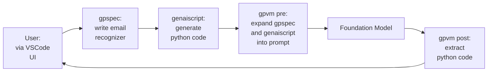

# genaiscript: Empowering Human Workflows with AI-Enhanced Tools

-   Authors: Peli de Halleux, Michał Moskal, Ben Zorn
-   Date: October 2023
-   Repository: [genaiscript](https://github.com/microsoft/genaiscript/tree/main)

## Abstract

genaiscript is a framework that empowers teams, including non-developers, to create and use AI-enhanced scripts to support their workflows. genaiscript provides support for creating, understanding, and maintaining complex collections of documents such as software repositories, project management, etc. Our framework leverages foundation models (specifically LLMs) to enable a new kind of scripting that combines traditional code and natural language. The key elements of the genaiscript framework are **gpspecs** and **genaiscript**. gpspecs are natural language documents that describe specific user tasks to accomplish. genaiscript are general scripts that combine traditional software and natural language prompts and rely on an LLM to generate results. We execute genaiscript in the context of a gpspec to achieve a result. By separating these two abstractions, we allow genaiscript to be authored, maintained, and updated independently of the gpspecs that use them. The genaiscript framework includes an execution engine to execute a genaiscript and an IDE extension to VS Code to support user interaction with the genaiscript. We believe that genaiscript will empower even non-developers to automate their workflows in ways that were previously impossible.

## Introduction

This document describes the genaiscript framework, which empowers teams, including non-developers, to use AI-enhanced scripts to support their efforts in creating, understanding, and maintaining complex artifacts. genaiscript leverages foundation models (LLMs) to enable a new kind of scripting that combines traditional code and natural language. To understand how genaiscript works, we provide an example. The key elements of genaiscript include gpspecs, genaiscript, the gpvm, and the genaiscript extension to VS code.



This diagram illustrates the workflow of genaiscript with a concrete example. The user wants to write a python function that recognizes well-formed email addresses and writes a gpspec. She then invokes a genaiscript, one that will generate python code from a spec, on that gpspec, much as a user might call a python script with some arguments. The gpvm composes the gpspec with the genaiscript creating an LLM prompt, which in turn is passed to the foundation model. The foundation model returns a result (python code) to the gpvm, which postprocesses it, creates the requested python file, and notifies the user.

This document will motivate the design of the genaiscript framework, illustrate its use with examples, and describe elements of implementation.

## Complex Artifacts Require Complex Workflows

-   Software development is a complex process that requires the coordination of many different activities.
-   Historically, software development has been a highly manual process, with developers using a variety of tools to create and maintain the artifacts that comprise a software system.
-   Over time abstractions have been developed to help manage the complexity of software development.
    -   Important examples include: Unix utilities and pipes, makefiles, build scripts, etc.
-   Modern software development includes many automated processes as well as manual processes such as code review, design review, bug triage, etc.

## Foundation Models Create New Opportunities

-   The recent development of foundation models (aka LLMs) have created new opportunities for automating complex workflows.
-   AI has important advantages over traditional software:
    -   AI models can perform tasks normal software cannot
    -   AI models can be instructed using natural language, allowing non-programmers to use them
-   AI models also have disadvantages:
    -   AI models are not perfect, and can make mistakes
    -   AI models are not transparent, and it is difficult to understand why they make the decisions they do
-   AI models are best used to augment human workflows, not replace them

## genaiscript - a Framework for AI-Enhanced Workflows

Vision: empower teams, including non-developers, to use AI-enhanced scripts to support their efforts to create, understand, and maintain complex artifacts

Goals: support tool abstraction, modularity, reuse, but at the same time empower non-developers to author, maintain, and update AI-enhanced scripts

Approach: Foundation models enable a new kind of scripting that allows script writers to achieve both greater functionality and greater ease of use. We separate scripts into two related parts: a generic reusable _genaiscript_ and a natural language _gpspec_ that instantiates the genaiscript in a particular context

Key elements of genaiscript:

-   _genaiscript_ – Scripts that integrate traditional code and natural language and leverage foundation models in their execution
-   _gpspecs_ – Natural language documents that instantiate genaiscript in a particular context
-   _gpvm_ – A framework and runtime system that executes gpspecs and genaiscript
-   _genaiscript extension to VS code_ – supporting seamless user interaction with genaiscript

## genaiscript: A New Kind of Script

-   A genaiscript is a script with the following components

    -   A header that contains metadata related to the execution of the script (e.g., information about what LLM model to use, etc.)
    -   A natural language prompt intended to be processed by a foundation model
    -   An environment context that augments the natural language with additional data/information
    -   Programming language constructs that are used to programmatically manipulate both inputs and outputs

-   Benefits of genaiscript
    -   By separating the genaiscript from the gpspec, we allow genaiscript to become highly engineered shared artifacts, forming the basis of shared libraries.
    -   A genaiscript can be used in many different contexts, and can be updated and maintained independently of the gpspecs that use it.
    -   By separating the genaiscript from the gpspec, we allow non-developers to use genaiscript without having to understand the details of how they work.
    -   At the same time, because a genaiscript contains a natural language prompt, it is easy for a non-developer to understand what the genaiscript does, and to modify it to suit their needs.

## gpspec: Natural Language to Invoke a genaiscript

Just as a chat enables a user to interact with an AI model, a gpspec is a natural language markdown document that defines a context in which to invoke a genaiscript.

A gpspec is a standard markdown file, with the following additional elements:

-   Links to context elements that define the context in which a particular genaiscript is to be invoked. For example, a gpspec might contain links to markdown files, code files, etc.
-   Natural language describing the specific task to be performed as input to a genaiscript. For example, the spec used to generate code would include a description of the functionality and might include a description style guidelines to observe, etc.

. A single gpspec file might be used as input to multiple genaiscript. For example, a gpspec might be used to generate code, documentation, and tests, each using a different genaiscript.

## Expanding the Example

To better understand how genaiscript work, we expand the example given above. The diagram below illustrates the genaiscript workflow in greater detail. Our design of genaiscript is based on the following principles:

-   genaiscript are used in a context where there is human oversight on the content generated. As a result, our workflow starts and ends with the user.
-   We assume that the output of a genaiscript may be incomplete or incorrect, and that the user will need to interact with the output to refine it. As a result, we allow the user to accept/reject and directly modify the AI-generated content.
-   We assume that the user will want to understand how the AI model was used to generate the results. We provide a trace of how the gpvm composes the gpspec and genaiscript into a prompt that can be processed by the foundation model.
-   We support iterative development, where the user can both edit the gpspec and the genaiscript if they see opportunities to improve the results.


This diagram demonstrates the AI-enhanced workflow process in genaiscript. The gpspec instantiates the genaiscript, which interacts with the gpvm and foundation model. The AI-generated output is used to update the context, and the user interacts with the updated context through the genaiscript extension to VS code.

### genaiscript Example: Python Developer genaiscript

This is an example of a simple genaiscript that generates python code from a gpspec file:

```javascript
script({
    title: "Generate python code",
    model: "gpt-4",
    description: "Given a task, generate python code.",
})

def(
    "CODE",
    env.files.filter(
        (f) => f.filename.endsWith(".py") && !f.filename.startsWith("test_")
    )
)
def("TASK", env.spec)

$`Generate python code for the task in TASK. Save code in CODE. If the CODE is already present, ensure that CODE matches the description in TASK and make changes to CODE if it does not.`
```

In this example we see the following elements:

-   A header that contains metadata related to the execution of the script (e.g., information about what LLM model to use, etc.)
-   JavaScript code that manipulates the environment context, specifically by extracting only the python files from the context that do not start with "test\_".
-   Variable definitions that allow the prompt to refer to elements in the context. TASK refers to the gpspec file, and CODE refers to the python files in the context.
-   Natural language that combines these elements.

### gpspec Example: Using the Python Developer genaiscript

This is an example of a gpspec file that uses the python generating genaiscript shown above:

```markdown
# email address and URL recognizer

Write a function that takes a string argument and returns true if the whole string is a valid email address, false otherwise.
```

In this example, there is no additional context needed to invoke the python developer genaiscript. In other cases, the gpspec file will contain links to additional context elements, such as markdown, code files, etc.

## gpvm - A Framework for Executing gpspecs and genaiscript

Every system that interacts with a foundation model includes layers that transform user input into a prompt that can be processed by the foundation model, and layers that transform the output of the foundation model into a form that is useful to the user.

-   gpvm is a runtime environment that:
    -   Captures the context defined by the gpspec
    -   Executes whatever code is present in the genaiscript (in the example above, the variables CODE and TASK are defined by executing JavaScript code)
    -   Expands the gpspec and natural language of the genaiscript into a prompt that can be processed by the foundation model
    -   Sends the results to the AI model
    -   Processes the results on return to update the user context (which might include creating files, updating files, generating user feedback, etc.)

Unlike many AI model orchestration frameworks, such as Semantic Kernel, gpvm does not leverage the model to do chain-of-thought reasoning or utomatically stage multiple invocations of the AI model during its execution. genaiscript currently relies on the user to choose and invoke the appropriate genaiscript as needed.

## genaiscript Extension to VS Code

We believe that human oversight of AI models is essential to their effective use. To support this, we have created a VS Code extension that allows a user to interact with a gpspec and genaiscript in a natural way.

The extension provides the following capabilities:

-   A command palette that allows a user to select a genaiscript to invoke in the context of a given gpspec file
-   A token management system that supports connecting with the AI model of interest
-   An invocation of the gpvm to process the user input and generate results
-   A user interface that allows the user to interact with the AI model to refine the results
-   A genaiscript trace viewing mechanism that allows users to understand how the AI model was used to generate the results

## Implications of genaiscript

The existence of powerful programming tools based on AI that are usable by non-developers is transformative.

Just as the development of JavaScript enabled Web 2.0, and python enabled the creation of the current AI software ecosystem, genaiscript will fuel a new generation of AI-enhanced applications.

We envision the creation of genaiscript for many different verticals, with opportunities for customization and authoring at many levels of expertise:

-   Professional developers and architects will define collections of genaiscript for a given vertical just as packages are authored and maintained today
-   Professional developers can author and maintain individual genaiscript
-   Developers and non-developers can customize genaiscript for their particular organization or application needs
-   Non-developers can author and maintain gpspecs for their particular projects

Furthermore, the existence of genaiscript can empower non-developers to automate their workflows in ways that were previously impossible.

## Related Work

genaiscript are related to a number of foundation model projects that automate workflows and encapsulate LLM actions in software artifacts. We describe some of these projects below:

### AI Tools for Developers

-   [GitHub Copilot](https://copilot.github.com/) is a VS Code extension that uses the Codex LLM to suggest code completions based on the context of the current file. Copilot provides LLM support for writing code but does not currently have an extensibility model or a way to create, maintain and apply collections of AI-enhanced scripts.
-   [codeplan](https://arxiv.org/abs/2309.12499) is a task-agnostic framework that frames repository-level coding as a planning problem, synthesizing a multi-step chain of edits where each step results in a call to an LLM on a code location with context derived from the entire repository, previous code changes, and task-specific instructions. While codeplan uses LLM prompts to generate code, it does not provide a way to create, maintain and apply collections of AI-enhanced scripts.

### LLM Automation/Orchestration Frameworks

-   [autogpt](https://github.com/Significant-Gravitas/AutoGPT) is an AI agent that utilizes a large language model to drive its actions and decisions. Unlike traditional language model applications, AutoGPT does not require repeated prompting by a human and can autonomously develop and manage tasks.
-   [langchain](https://www.langchain.com/) is a Python library designed to simplify the development of Natural Language Processing (NLP) applications using large language models. It provides a framework for connecting language models to other sources of data and allowing them to interact with their environment.
-   [semantic kernel](https://github.com/microsoft/semantic-kernel) is an open-source SDK that allows developers to easily integrate AI services with conventional programming languages such as C# and Python. It provides a framework for connecting language models to other sources of data, allowing them to interact with their environment and perform tasks autonomously.
-   [autogen](https://arxiv.org/abs/2308.08155) is a framework for simplifying the orchestration, optimization, and automation of large language model (LLM) workflows. It offers customizable and conversable agents that leverage LLMs while addressing their limitations by integrating with humans and tools and having conversations between multiple agents via automated chat.

genaiscript differ from existing AI task automation frameworks in the following ways:

-   genaiscript are designed to be authored, maintained, and applied by non-developers as well as developers.
-   genaiscript define a separation between the genaiscript and the gpspec that instantiates it, allowing for modularity, reuse, and easier understanding by non-developers.
-   genaiscript do not assume task automation and provide a user experience that integrates seamlessly with VS code.
-   The genaiscript UI exposes both the content and execution of each genaiscript to facilitate human oversight and understanding of how the AI model was used to generate the results.
