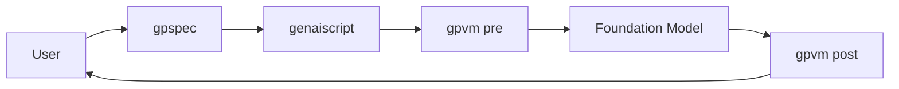
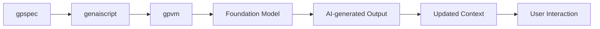
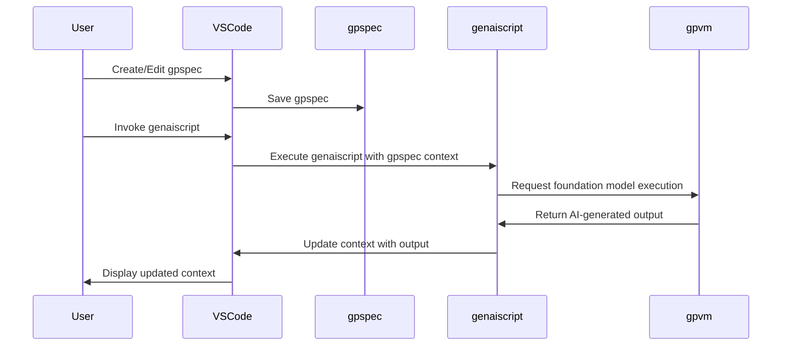

### Diagram 1: genaiscript Workflow Overview

This diagram illustrates the workflow of genaiscript, which includes the user, gpspec, genaiscript, gpvm, and foundation model. The user creates a gpspec, which instantiates a genaiscript. The gpvm executes the genaiscript with the gpspec, which invokes the foundation model. The foundation model returns a result to the gpvm, which postprocesses it and returns it to the user.

---

### Diagram 2: AI-Enhanced Workflow Process in genaiscript

This diagram demonstrates the AI-enhanced workflow process in genaiscript. The gpspec instantiates the genaiscript, which interacts with the gpvm and foundation model. The AI-generated output is used to update the context, and the user interacts with the updated context through the genaiscript extension to VS code.

### Diagram 5: AI-Enhanced Workflow Process in genaiscript

This diagram demonstrates the AI-enhanced workflow process in genaiscript. The gpspec instantiates the genaiscript, which interacts with the gpvm and foundation model. The AI-generated output is used to update the context, and the user interacts with the updated context through the genaiscript extension to VS code.