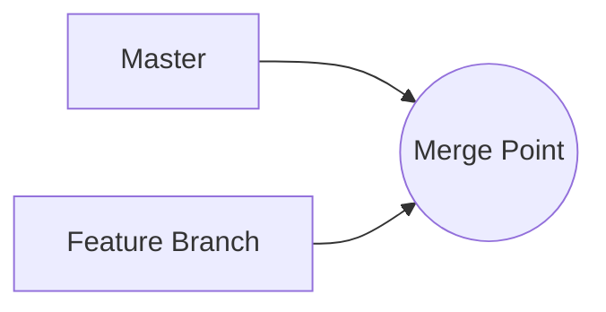
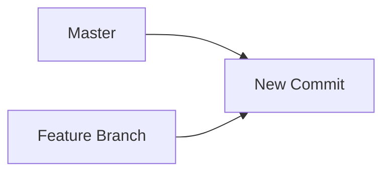

It is often useful to request an LLM to generate a diagram. Fortunately,
many LLMs already know [mermaid](https://mermaid.js.org/), a popular Markdown extension
to create diagrams and charts.



## Automatic Mermaid syntax repair

The `system.diagrams` system prompt registers a repair chat participant that will try to fix any syntax errors in the generated Mermaid diagrams. It's not uncommon for LLMs to generate invalid Mermaid syntax, so this is a useful feature.

## Parser

You can invoke the mermaid parser directly
from GenAIScript using the `parsers.mermaid` function.

You can use the `result.error` value to check if the parsing was successful. If it was not, you can use the `result.error` value to repair the diagram with an LLM.

## Markdown Preview support

- Install the [Markdown Preview Mermaid Support](https://marketplace.visualstudio.com/items?itemName=bierner.markdown-mermaid) extension for VS Code.

- Mention `diagram` in the program or add `system.diagram` to the system prompt list.

```js
$`Generate a diagram of a merge.`
```

<!-- genaiscript output start -->

<details>
<summary>👤 user</summary>

```markdown wrap
Generate a diagram of a merge.
```

</details>

<details open>
<summary>🤖 assistant </summary>

````markdown wrap

````

</details>

<!-- genaiscript output end -->

The generated Markdown will appear as follows:

````markdown

````

and it gets rendered automatically once you install the extension.

