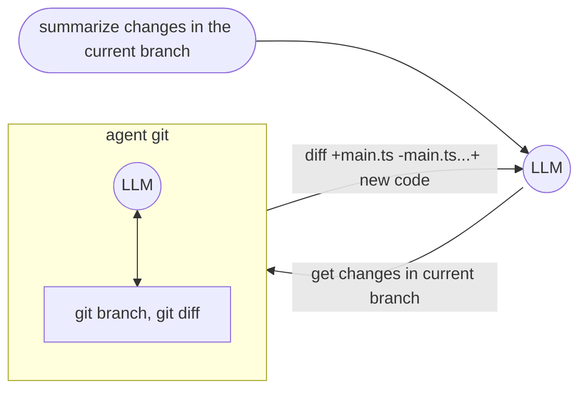

# Agent Tool = nested LLM + Tools

-   **Agent orchestration left to the LLM**
-   Agent tool description augment with nested tool description (not id!)

::left::



::right::

- definition

```js
defTool(
    "agent_git",
    "Agent that can query git",
    { query: { type: "string" } },
    async ({ query }) =>
        prompt`You are a git god. Answer ${query}.`.options({
            tools: ["git_branch", "git_diff"],
        })
)
```

- usage

```js
script({ tools: ["agent_git"]})
...
```
