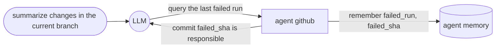
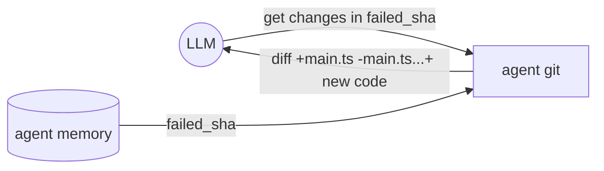

# Agent Memory

-   Top level LLM "forgets" to give details \*\*\*
-   Share findings with memory (LLM RAG log of agent query-answer pairs using SLM)

-   store

```mermaid
flowchart LR
    query(["summarize changes in the current branch"]) --> LLM((LLM))

    LLM --> |"query the last failed run"| agent_github
    agent_github["agent github"] --> |"commit failed_sha is responsible"| LLM

    memory[(agent memory)]
    agent_github --> |"remember failed_run, failed_sha"| memory
```

-   retreive

```mermaid
flowchart LR
    LLM((LLM))
    memory[(agent memory)]

    LLM --> |"get changes in failed_sha"| agent_git
    agent_git["agent git"] --> |"diff +main.ts -main.ts...+ new code"| LLM

    memory ---> |"failed_sha"| agent_git
```
