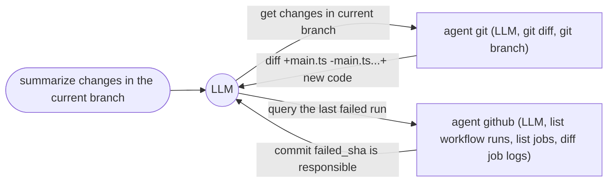

# Multiple Agents




```js
defAgent("git", "query git", "You are a git god.", {
    tools: ["git_branch", "git_diff"],
})
```

```js
defAgent("github", "query github", "You are a github god.", {
    tools: ["github_pulls", "github_job_log"],
})
```
