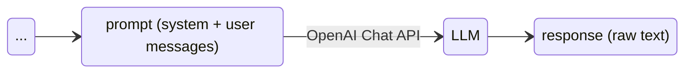

# Prompt + LLM = Response

- authentication: `.env` or `vscode.languageModel` (proposed API)
- re-format prompts for LLM APIs, like OpenAI vs Azure OpenAI

 
 

```mermaid
stateDiagram
  direction LR
    prompt : prompt (system + user messages)
    response: response (raw text)
    pre: ...
    pre --> prompt
    prompt --> LLM : OpenAI Chat API
    LLM --> response
```
