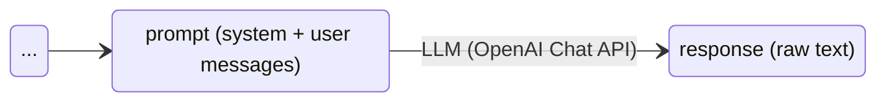

# Prompt + LLM = Response

-   authentication: `.env`, environment variables, Azure Entra
-   OpenAI API, Azure OpenAI, OLlama, AICI, ...

 
 

```mermaid
stateDiagram
  direction LR
    prompt : prompt (system + user messages)
    response: response (raw text)
    pre: ...
    pre --> prompt
    prompt --> response : LLM (OpenAI Chat API)
```
