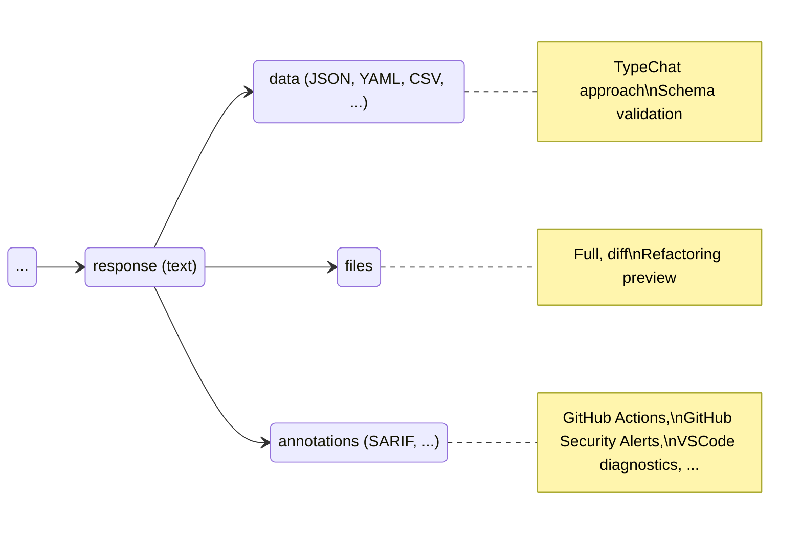

# Response + Parsers = Data + Files

```mermaid

stateDiagram
  direction LR
    response: response (text)
    data: data (JSON, YAML, CSV, ...)
    annotations: annotations (SARIF, ...)
    files: files
    note right of data: TypeChat approach\nSchema validation
    note right of files: Full, diff\nRefactoring preview
    note right of annotations: GitHub Actions,\nGitHub Security Alerts,\nVSCode diagnostics, ...
    LLM: ...
    LLM --> response
    response --> files
    response --> data
    response --> annotations
```