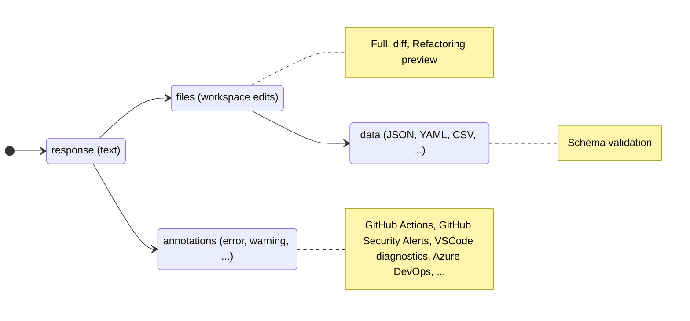

# Response x Parsers = Files + Data

- parse file edits (as refactoring preview in VSCode)
- parse diagnostics (error, warning, note)
- parse data + schema validation + error repair

```mermaid {scale:0.8}

stateDiagram
  direction LR
    response: response (text)
    files: files (workspace edits)
    data: data (JSON, YAML, CSV, ...)
    annotations: annotations (error, warning, ...)
    note right of data: Schema validation
    note right of files: Full, diff, Refactoring preview
    note right of annotations: GitHub Actions, GitHub Security Alerts, VSCode diagnostics, Azure DevOps, ...
    [*] --> response
    response --> files
    files --> data
    response --> annotations
```