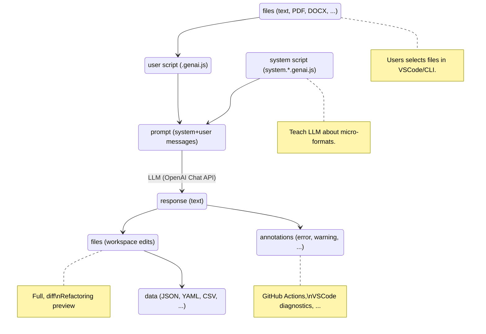

```mermaid { scale: 0.75 }
stateDiagram
    context: files (text, PDF, DOCX, ...)
    script : user script (.genai.js)
    prompt : prompt (system+user messages)
    system: system script (system.*.genai.js)
    context --> script
    note right of context : Users selects files in VSCode/CLI.
    script --> prompt
    system --> prompt
    note right of system: Teach LLM about micro-formats.
    prompt --> response : LLM (OpenAI Chat API)
    response: response (text)
    files: files (workspace edits)
    data: data (JSON, YAML, CSV, ...)
    annotations: annotations (error, warning, ...)
    note right of files: Full, diff\nRefactoring preview
    note right of annotations: GitHub Actions,\nVSCode diagnostics, ...
    response --> files
    files --> data
    response --> annotations
```
