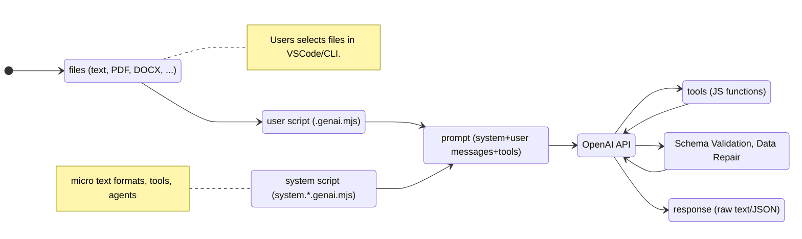

```mermaid

stateDiagram
  direction LR
    [*] --> context
    context: files (text, PDF, DOCX, ...)
    script : user script (.genai.mjs)
    prompt : prompt (system+user messages+tools)
    api: OpenAI API
    system: system script (system.*.genai.mjs)
    tools: tools (JS functions)
    context --> script
    note right of context : Users selects files in VSCode/CLI.
    script --> prompt
    system --> prompt
    prompt --> api
    api --> tools
    tools --> api
    api --> validation
    validation: Schema Validation, Data Repair
    validation --> api
    api --> response
    note left of system: micro text formats, tools, agents
    response: response (raw text/JSON)
```

- user runs script on files in VSCode/CLI/Web
- script generates chat messages (user and system messages)
- invocation of LLM (typically OpenAI REST API or compatible) + tools cycle
