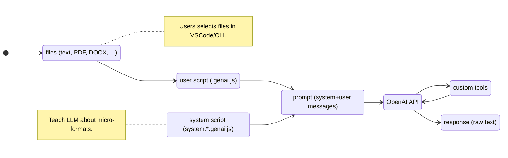

# Context x Script = Prompt

- user starts script on files in VSCode/CLI
- script generates prompt (user and system messages)
- invocation of LLM API with messages + access token (from `.env` or environment variables).

