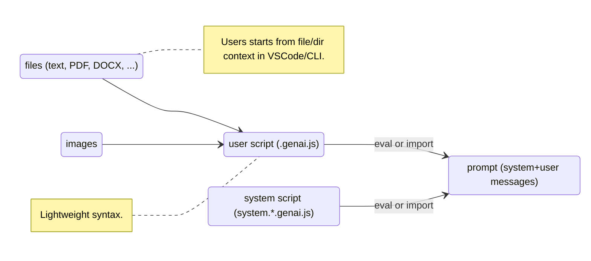

# Context + Script = Prompt

```mermaid

stateDiagram
  direction LR
    context: files (text, PDF, DOCX, ...)
    script : user script (.genai.js)
    prompt : prompt (system+user messages)
    system: system script (system.*.genai.js)
    context --> script
    note right of context : Users starts from file/dir context in VSCode/CLI.
    images --> script
    note left of script : Lightweight syntax.
    script --> prompt : eval or import
    system --> prompt : eval or import
```
