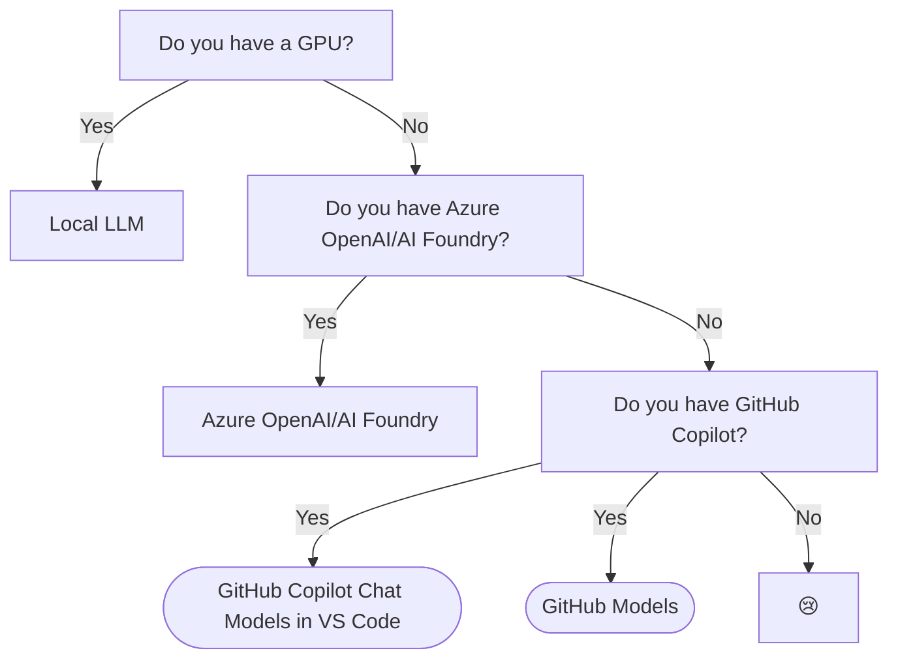

### Prelude: Where do I get LLM API access?

```mermaid {scale: 0.8}
flowchart TD
    A[Do you have a GPU?] -->|Yes| B[Local LLM]
    A -->|No| E[Do you have Azure OpenAI/AI Foundry?]
    E -->|Yes| F[Azure OpenAI/AI Foundry]
    E -->|No| G[Do you have GitHub Copilot?]
    G -->|Yes| I([GitHub Copilot Chat Models in VS Code])
    G -->|Yes| H([GitHub Models])
    G -->|No| K[😢]
```
