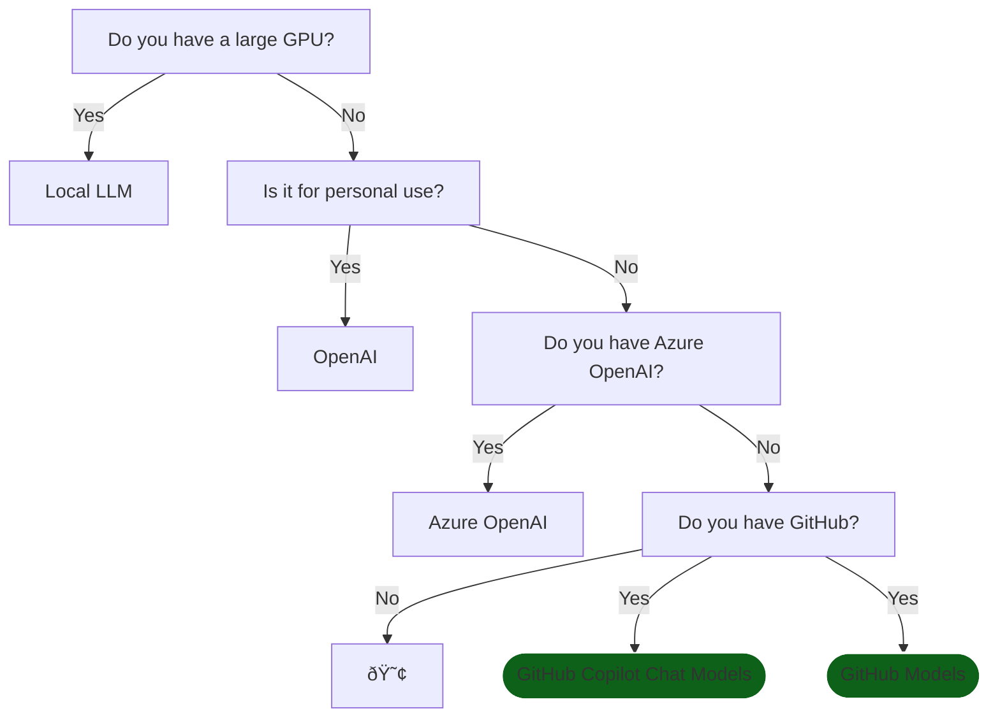

### Prelude: Where do I get LLM tokens?

```mermaid {scale: 0.9}
flowchart TD
    A[Do you have a large GPU?] -->|Yes| B[Local LLM]
    A -->|No| C[Is it for personal use?]
    C -->|Yes| D[OpenAI]
    C -->|No| E[Do you have Azure OpenAI?]
    E -->|Yes| F[Azure OpenAI]
    E -->|No| G[Do you have GitHub?]
    G -->|No| K[😢]
    G -->|Yes| I([GitHub Copilot Chat Models])
    G -->|Yes| H([GitHub Models])
    style I fill:#0e6119,stroke:#fff
    style H fill:#0e6119,stroke:#fff,stroke-width:2px
```
