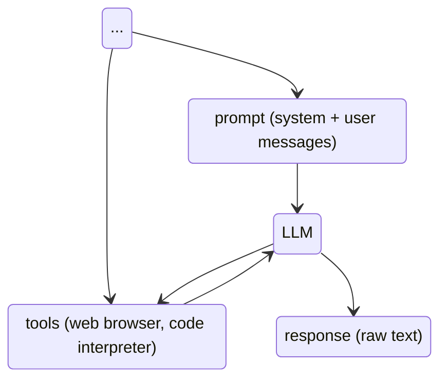

# Prompt + LLM + Tools = Agents

```mermaid
stateDiagram
    prompt : prompt (system + user messages)
    tools: tools (web browser, code interpreter)
    response: response (raw text)
    pre: ...
    pre --> prompt
    pre --> tools
    prompt --> LLM
    tools --> LLM
    LLM --> tools
    LLM --> response
```
