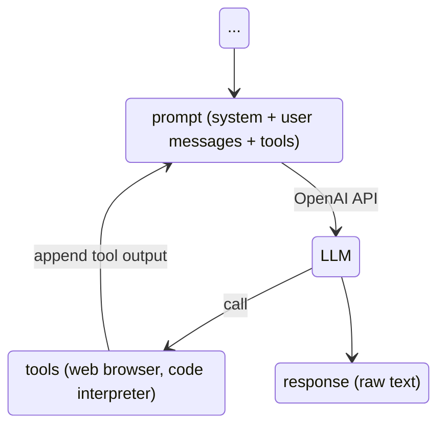

# Tools = JavaScript Function

- Tools are JavaScript functions
- Builtin "Agentic" framework

::left::



::right::

```js
defTool(
    "fs_read_file",
    "Reads a file as text from the file system.",
    {
        type: "object",
        properties: {
            filename: {
                type: "string",
                description: "Path of the file.",
            },
        },
        required: ["filename"],
    },
    async (args) => {
        const { filename } = args
        return await workspace.readText(filename)
    }
)
```
