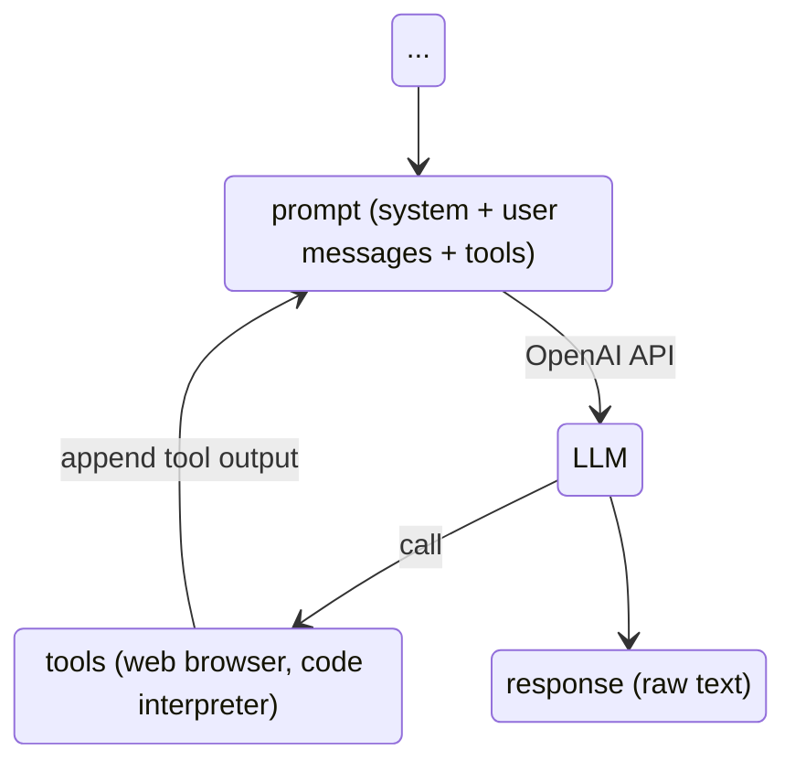

# Tool = JavaScript Function

::left::



::right::

- definition

```js
defTool(
    "fs_read_file",
    "Reads a file as text from the file system.",
    {
        filename: { type: "string" },
    },
    async ({ filename }) => await workspace.readText(filename)
)
```

- usage

```js
script({ tools: ["fs_read_file"]})
...
```
