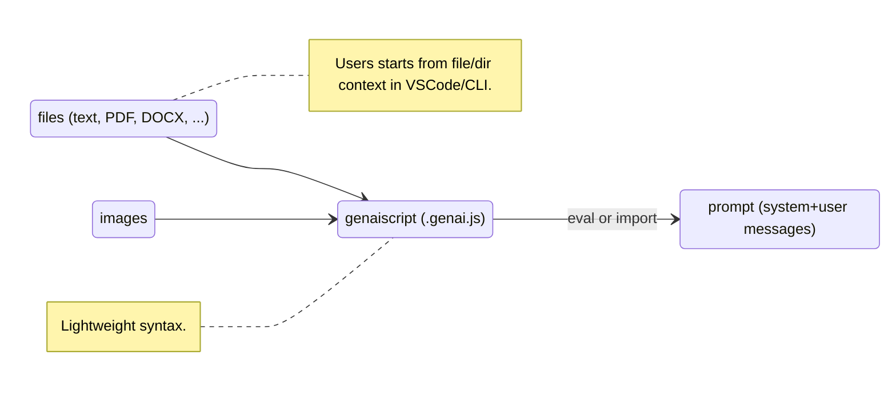
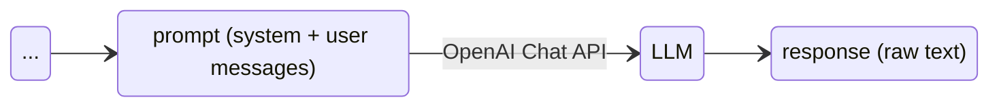
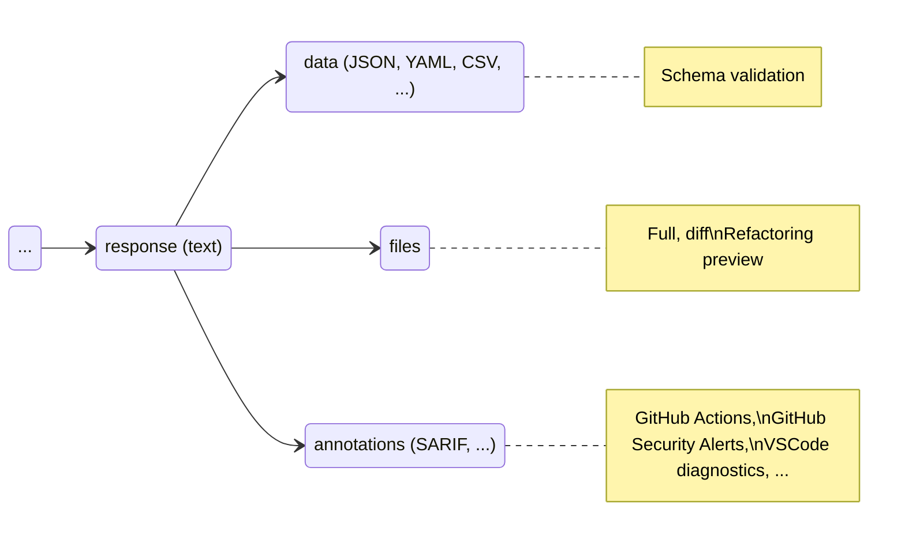
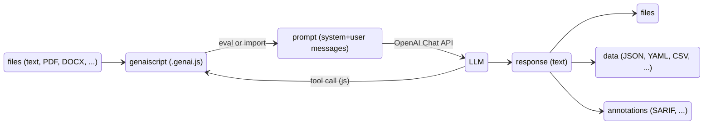

---
# try also 'default' to start simple
theme: default
title: GenAIScript
info: |
  ## GenAIScript
  Scripting for Generative AI.

  Learn more at [genaiscript](https://microsoft.github.io/genaiscript/)
class: text-center
# https://sli.dev/custom/highlighters.html
highlighter: shiki
# https://sli.dev/guide/drawing
drawings:
  persist: false
# slide transition: https://sli.dev/guide/animations#slide-transitions
transition: slide-left
# enable MDC Syntax: https://sli.dev/guide/syntax#mdc-syntax
mdc: false
---

# GenAIScript

Scripting for Generative AI.

---

# Context + Script = Prompt




---

# Context + Script = Prompt

- Generate Prompts with JavaScript
- `$` trick
- Builtin parsers
- `env.files` context

```js
// define the context
def("FILE", env.files, { endsWith: ".pdf" })
// structure the data
const schema = defSchema("DATA", 
    { type: "array", items: { type: "string" } })
// assign the task
$`Analyze FILE and extract data to JSON using the ${schema} schema.`
```

---

# Prompt + LLM = Response

- authentication: `.env` or `vscode.languageModel`
- tune prompts for LLM "preferences"



> #1 ISSUE: WHERE CAN I GET A OPENAI KEY!?!

---


# Response + Parsers = Data + Files



---


# Transformation Pipeline


