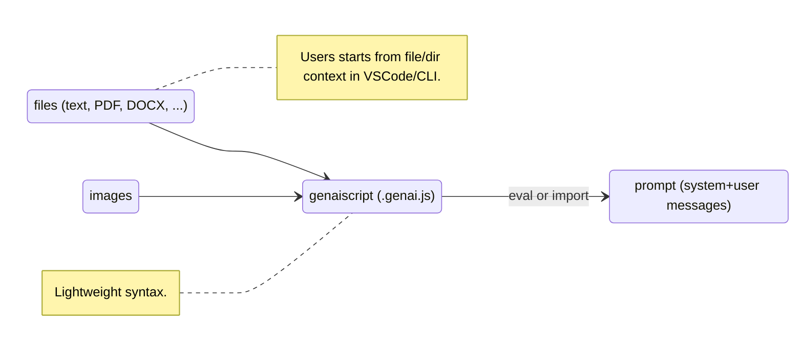
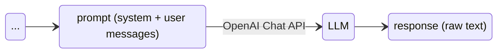
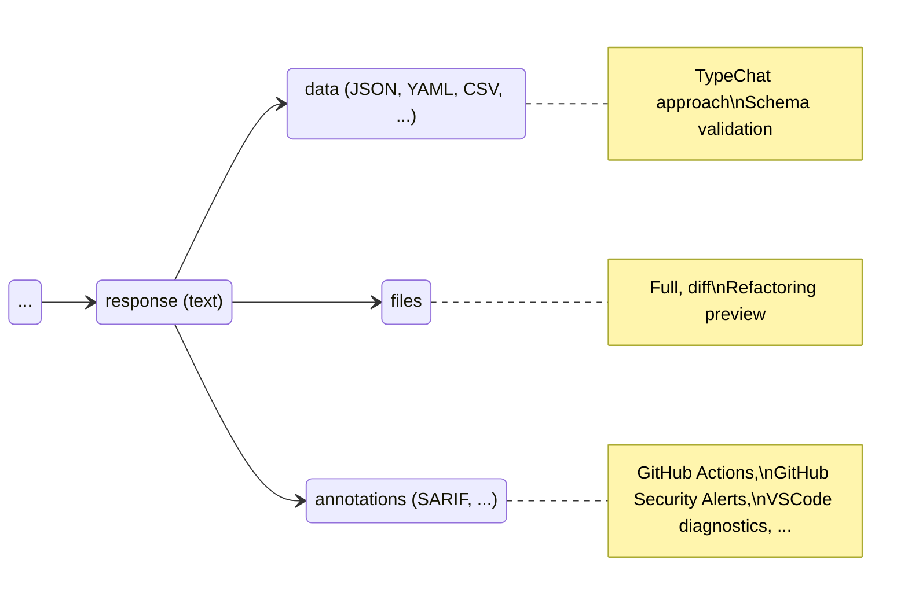

---
# try also 'default' to start simple
theme: default
title: GenAIScript
titleTemplate: '%s'
colorSchema: dark
favicon: 'https://microsoft.github.io/genaiscript/images/favicon.svg'
info: |
  ## GenAIScript
  Scripting for Generative AI.
class: text-center
# https://sli.dev/custom/highlighters.html
highlighter: shiki
# https://sli.dev/guide/drawing
drawings:
  persist: false
# slide transition: https://sli.dev/guide/animations#slide-transitions
transition: slide-left
# enable MDC Syntax: https://sli.dev/guide/syntax#mdc-syntax
mdc: false
---

# GenAIScript

## Scripting for Generative AI.

<br/>
<br/>

https://microsoft.github.io/genaiscript/

---

# Context + Script = Prompt




---

# Context + Script = Prompt

- It Is Just JavaScript(TM),  `$` writes to the prompt, builtin parsers
- context in `env` (like `env.files`)

```js
// define the context
def("FILE", env.files, { endsWith: ".pdf" })
// structure the data
const schema = defSchema("DATA", 
    { type: "array", items: { type: "string" } })
// assign the task
$`Analyze FILE and extract data to JSON using the ${schema} schema.`
```

<br/>

````txt
FILE lorem.pdf:
Lorem Ipsum ...

DATA:
type Data = string[]

Analyze FILE and extract data to JSON using the DATA schema.
````

---

# System prompts

Teach the LLM how to format response for files, special formats, register tools ...

- `system.files.genai.js`
```js
system({ title: "File generation" })
$`When generating or updating files you will use the following syntax:`
...
```

- `system.diff.genai.js`
```js
system({ title: "Diff generation", lineNumbers: true,})
$`The DIFF format should be used to generate diff changes on files: 
- added lines MUST start with +
- deleted lines MUST start with -
- deleted lines MUST exist in the original file (do not invent deleted lines)
- added lines MUST not exist in the original file
...
```

---

# Prompt + LLM = Response

- authentication: `.env` or `vscode.languageModel`
- tune prompts for LLM "preferences"



> #1 ISSUE: WHERE CAN I GET A OPENAI KEY!?!

---


# Response + Parsers = Data + Files



---

# JavaScript execution

- In process eval

```js
script(...)
$`Write a poem.`
```

- Debugging through `sourceMappingURL` + CLI

- Support for `esm` through dynamic `import`

```js
script(...)
export default async function() {
    $`Write a poem.`
}
```

---

# VSCode Extensions

Hard/unsolved limitations encountered.

- dynamic imports not supported
  - pdfjs-dist cannot be bundled
  - _not every dependency can be bundled_
  - works in dev mode, not in electron
- process execution cross-platform hard
  - run process, read exit code, stdout, stderr
  - bash vs powershell vs zsh vs ...
- language model proposal (yes!)
- chat participants initially investigated but not a good fit
